<<<<<<< HEAD
# Oracle Audit Vault and DB Firewall (AVDF)

## Introduction
This workshop introduces the various features and functionality of Oracle Audit Vault and DB Firewall (AVDF). It gives the user an opportunity to learn how to configure those appliances in order to audit, monitor and protect access to sensitive data.

*Estimated Lab Time:* 110 minutes

*Version tested in this lab:* Oracle AVDF 20.13

### Video Preview

Watch a preview of "*LiveLabs - Oracle Audit Vault and Database Firewall*" [](youtube:eLEeOLMAEec)


### Objectives
- Assess the security posture of the registered Oracle database targets
- Set a baseline and detect drift of the security configuration
- Discover sensitive data
- Configure the auditing for the Oracle database
- Explore the interactive reporting capabilities, including user entitlement
- Simply compliance with pre-defined reports, including activity on sensitive data
- Train the DBFW for the authorized application query and prevent the SQL injection


### Prerequisites
This lab assumes you have:
- A Free Tier, Paid or LiveLabs Oracle Cloud account
- You have completed:
    - Lab: Prepare Setup (*Free-tier* and *Paid Tenants* only)
    - Lab: Environment Setup
    - Lab: Initialize Environment

### Lab Timing (estimated)


| Step No. | Feature | Approx. Time |
|--|------------------------------------------------------------|-------------|
|| **AVDF Labs**||
|04| Reset the password | <5 minutes|
|05| Assess and Discover | 20 minutes|
|06| Audit and Monitor | 20 minutes|
|07| Report and Alert | 20 minutes|
|08| Protect and Prevent | 20 minutes|
|| **Optional**||
|09| Advanced features configuration | 25 minutes|
|10| Reset the AVDF labs config | <5 minutes|

## Lab 5: Assess and Discover

AVDF Security assessment gives you a simplified fleet-wide view of the security configuration for all your Oracle databases, along with the security findings and associated risks. Detailed remarks help you better understand risk and evaluate strategies to minimize that risk. 

In this lab, you will do the following:

- Assess the security posture of the Oracle database
- Set the baseline and track the drift against the baseline
- Discover the sensitive data in your database and create a global set

### Step 1: Assess the security posture of the Oracle database

1. Login to Audit Vault Web Console as *`AVAUDITOR`* (use the newly reset password)

    

2. Click on the **Targets** tab

3. Click on **Schedule Retrieval Jobs** for **pdb1**

       

4. Under **Security Assessment**
    - Checkbox *Assess Immediately*
    - Checkbox *Create/Update Schedule*
    - Change the **Schedule** radio button to *Enable*
    - Set **Repeat Every** to *1 Days*

        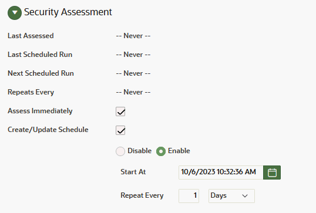

    - Click [**Save**] to save and continue

    **Note**: By default, retreival job has been already scheduled for **pdb2** during the deployment

5. Click on the **Home** tab

    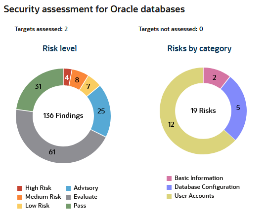

    **Note**:
    - Now, you can see the risks for all your taregts directly on the main dashboard
    - You can access to a risk by clicking on a color risk in the circle of your choice

6. Click on the **Reports** tab

7. Click the **Assessment Reports** sub-menu on left

8. In the **Assessment Reports** section, click on the **Summary by Severity** report

    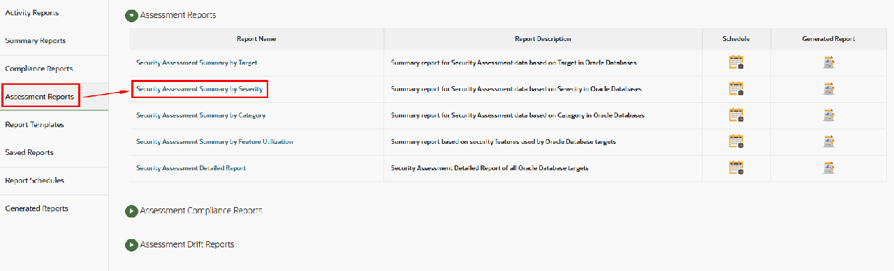

9. For all your targets, you can now see a complete assessment of the risks classified by severity for each category

    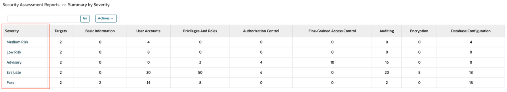

10. For example, click on **Medium Risk** to see the risks detected for all your targets

11. Now, click on one of them to see its details. Alternatively, you can also click on one of the assessments and add the exception by changing the severity or deferring the assessment.

    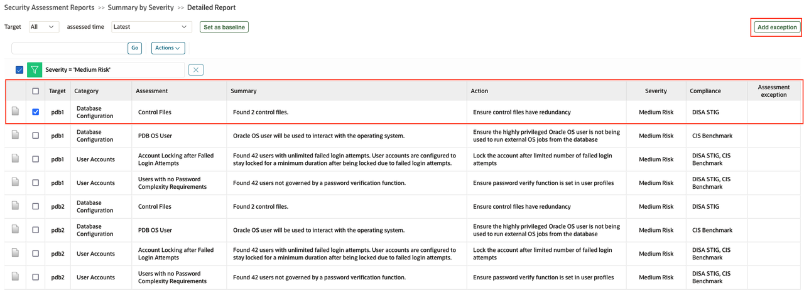

12. You can see all the details of this risk, why you're at risk and not compliant and how to remedy it

    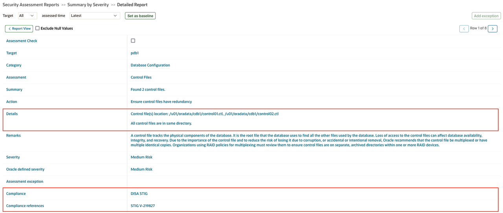

    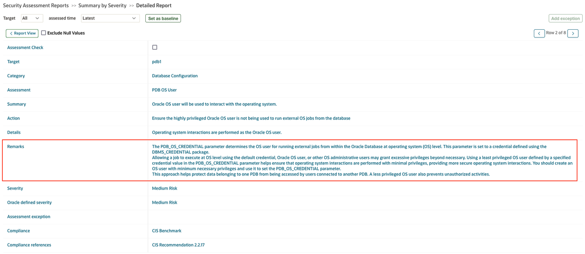


### Step 2: Set the baseline and track the drift against the baseline

1. Go back to the Home tab (Do not logout in stay logged as *`AVAUDITOR`*)

2. On the Security assessment drift graph, click on "**Targets with no baseline**"

    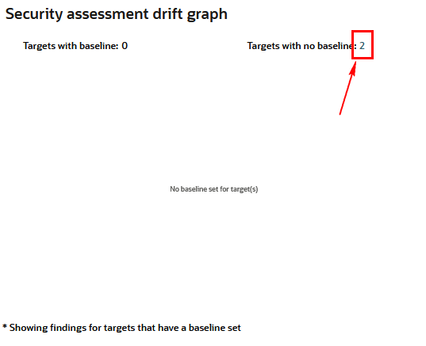

3. Set a baseline for both the targets **pdb1** and **pdb2** one by one

    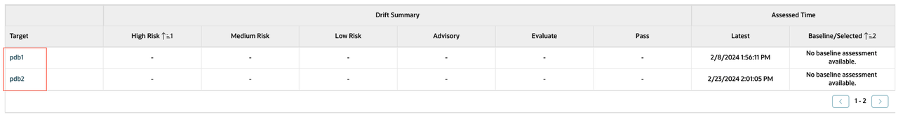

    - Click on **pdb1**
    
    - Select the assessment "**Latest**", and click on "**Set as baseline**"

        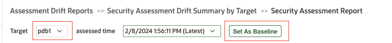

    - Repeat the same for **pdb2**

4. Now, create the drift from the previous scan
=======
# Assess your database: risks, users, and data

## Introduction
Assessing your database - its configuration risks, user access, and the sensitivity of stored data is essential to understanding your current security posture. It provides a clear view of potential vulnerabilities, exposure points, and privilege misuse that could impact your environment. This insight enables you to prioritize mitigation efforts effectively and focus on the areas that pose the greatest risk to your organization.

*Estimated Lab Time:* 10 minutes

*Version tested in this lab:* Oracle Database Security Central
<!--
### Video Preview

Watch a preview of "*LiveLabs - Oracle Database Security Central*" [](youtube:eLEeOLMAEec)
-->

### Objectives
- Review your security risk posture
- Review your sensitive data landscape
- Review the security policy landscape
- Review the global sets

## Task 1: Review your security risk posture
The Security Insights in **Security Central** Console provides a unified, actionable view of your organization’s database security risks by delivering an in-depth assessment of security posture across your Oracle Database fleet. It analyzes key areas such as configurations, user accounts, and sensitive data to surface potential risks.

By offering a simplified, fleet-wide perspective across your entire Oracle Database fleet, it enables teams to quickly identify high-risk areas, prioritize mitigation efforts, and take focused action to strengthen the overall security posture.

<details>
<summary>**Step 1: Assess configuration risks**</summary>

1. Log in to the Security Central Console as *`AVAUDITOR`* (use the newly reset password)


    

2. Click on the **Security Console** tab

3. Click on **Security Insights** in the left menu

    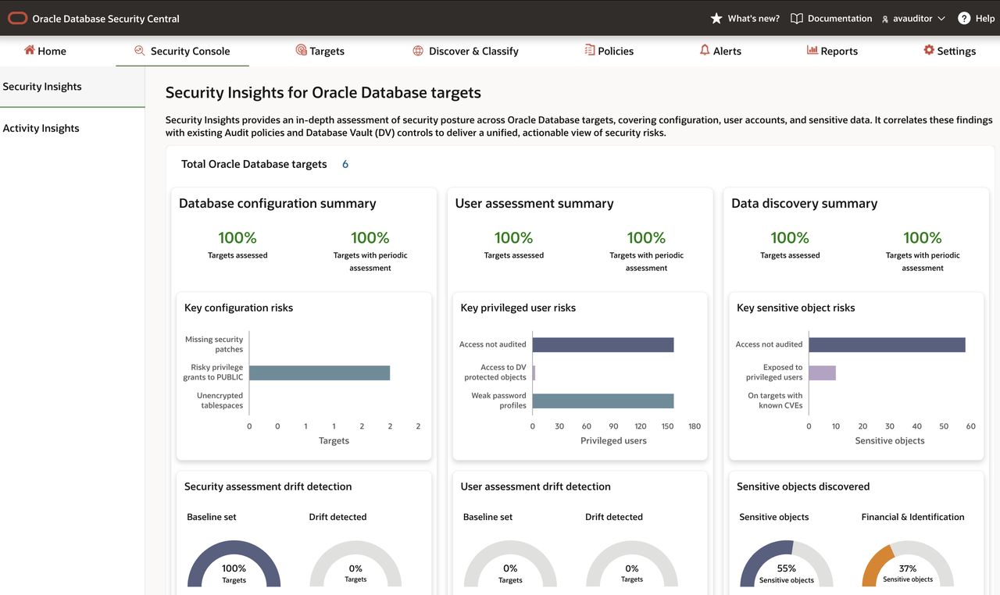   

4. Review the key configuration risks under **Database configuration summary**
    - Observe the configuration risks that need to be mitigated
        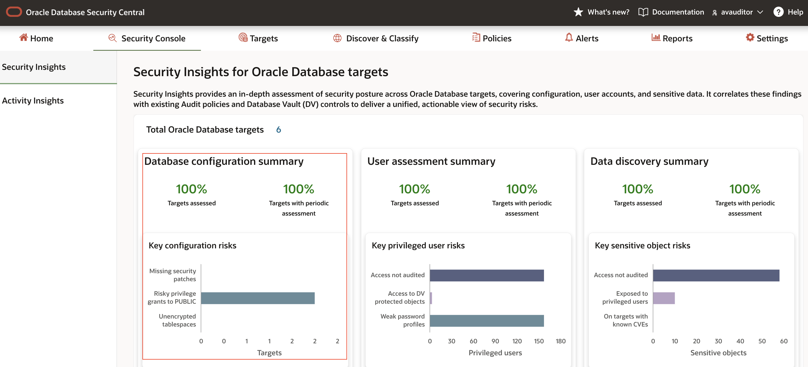
    
    - Drilldown into the data showing **Risky privilege grants to PUBLIC** 
        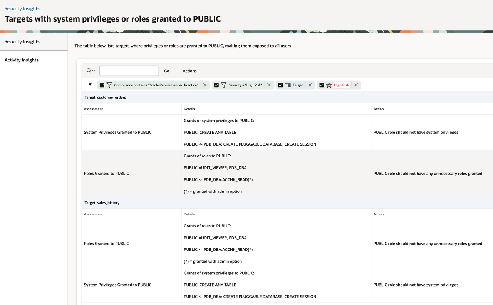

    **Note**: Targets **`sales_history`** and **`customer_orders`** have system privileges/ roles granted to **PUBLIC**. Any privilege assigned to PUBLIC is effectively given to everyone, often far beyond what is necessary. It is safer to assign roles and privileges explicitly to specific users or groups based on well-defined requirements.

     - Click [**Security Insights**] to go back to the console.

5. Let's go to the terminal session to mitigate the risk
>>>>>>> ecfd685b6409977b9a29d88ace059340a60acbbd

    - Open a terminal session on your **DBSec-Lab** VM as OS user *oracle*

        ````
        <copy>sudo su - oracle</copy>
        ````

        **Note**: Only **if you are using a remote desktop session**, click on "Activities" at the top left of the desktop and click on terminal to launch a session directly as Oracle. In that case **you don't need to execute this command**!

    - Go to the scripts directory

        ````
        <copy>cd $DBSEC_LABS/avdf/avs</copy>
        ````

<<<<<<< HEAD
    - Generate the drift for **pdb1**

        ````
        <copy>./avs_drift-gen.sh pdb1</copy>
        ````

        

    - Generate the drift for **pdb2**

        ````
        <copy>./avs_drift-gen.sh pdb2</copy>
        ````

        

        **Note:** Here, we grant to PUBLIC the `DBA` role for **pdb1** and `PDB_DBA` role for **pdb2**

5. Go back to Audit Vault Web Console as *`AVAUDITOR`* to generate an assessment

    - Click on "**Targets**",
    
    - Then click on "**Schedule retrieval job**" for **pdb1**
    
    - Under **Security Assessment**
        - Checkbox **Assess Immediately** 
        - Click [**Save**] to save and continue
    
    - Do the same for **pdb2**

6. Click **Home** to go back to the Auditor dashboard and examine the **Security assessment drift graph**

    **Note:** The graph gives you a clear picture of drifts on all the targets where the baseline has been set

7.	Click on any of the evaluations, like **Pass** or **High Risk**, which will take you to the detailed drift report

    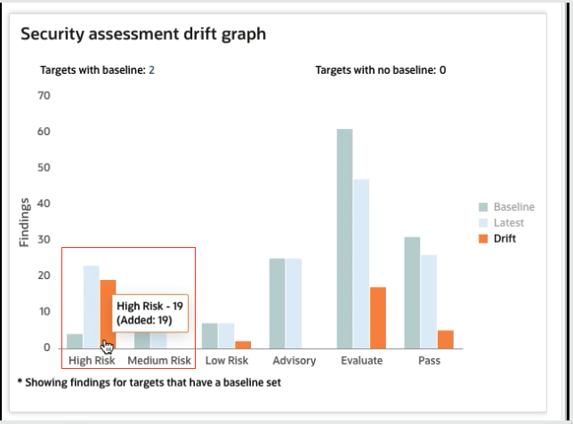

8. Now, go back to the terminal session to mitigate the risk

    - for **pdb1**

        ````
        <copy>./avs_mitigate-risk.sh pdb1</copy>
        ````

        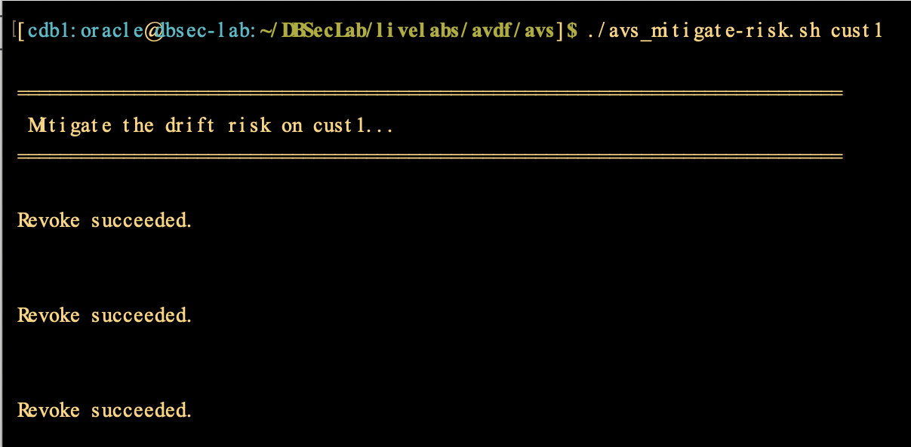

    - for **pdb2**

        ````
        <copy>./avs_mitigate-risk.sh pdb2</copy>
        ````

        

9. Go back to Audit Vault Web Console as *`AVAUDITOR`* to generate an assessment

    - Click on "**Targets**",
    
    - Then click on "**Schedule retrieval job**" for **pdb1**
    
    - Under **Security Assessment**
        - Checkbox **Assess Immediately** 
        - Click [**Save**] to save and continue
    
    - Do the same for **pdb2**

10. Click **Home** to go back to the Auditor dashboard and examine the **Security assessment drift graph** to see if the identified risk has been fixed. You will notice that after revoking the permissions granted at step 4, the risk counts return to their previous state of zero high risk. 

    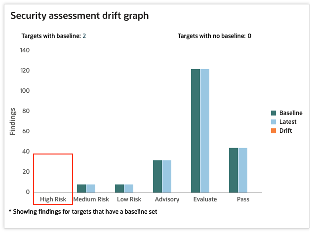

### Step 3: Discover the sensitive data in your database and create a global set

1. Go back to the Home tab (Do not logout in stay logged as *`AVAUDITOR`*)

2. Click on the **Targets** tab

3. Click on **Schedule Retrieval Jobs** for **pdb1**

       

4. Under **Sensitive Objects**
    - Checkbox *Discover Immediately*
    - Checkbox *Create/Update Schedule*
    - Change the **Schedule** radio button to *Enable*
    - Set **Repeat Every** to *1 Days*

        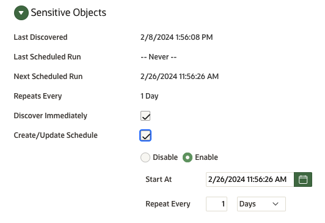

    - Click [**Save**] to save and continue

    **Note**: By default, retreival job has been already scheduled for **pdb2** during the deployment

5. Click on "**Global Sets**" tab

    **Note:** Create and manage global sets like IP address, database user, operating system user, client program, privileged user, and sensitive object sets on this page

6. To create sensitive object sets, expand "**Sensitive object sets**", then click [**Add**]

    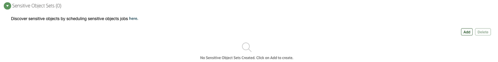

7. Under **Add sensitive object set**
    - Name: *GDPR_set1*
    - Description: *List of sensitive objects*
    - Targets: Select *pdb1* and *pdb2*
    - Leave "Category" and "Sensitive Objects" as default
    - Click [**Save**] to save and continue
    
        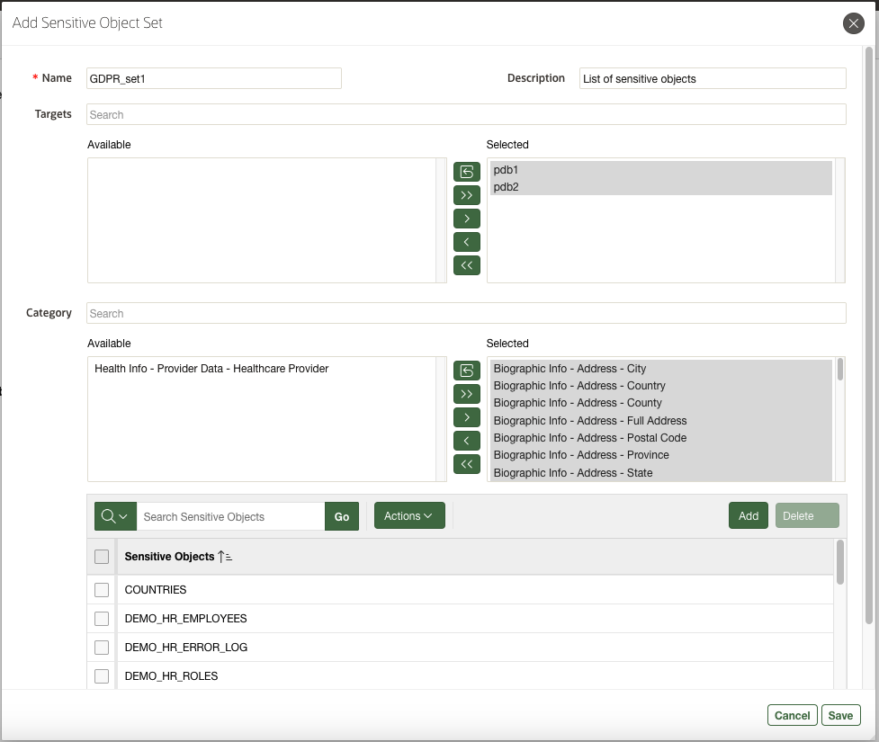

8. A sensitive object set by the name of GDPR_set1 is created. You can use this set in All Activity and GDPR reports. You can also use these sets in your database firewall and alert policy. Notice under **In use**, it is still **No**since this global set has not been used in any alert or database firewall policy yet.

    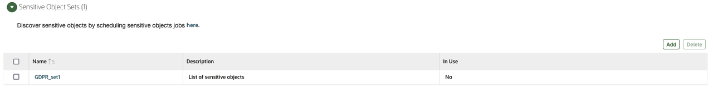

> #### What did we learn in this lab
>    
>> Before knowing what to monitor and protect, it's important to learn where my sensitive data is and what is the security posture of my Oracle database. In this lab, we have learned:
>>    - How to assess the security posture of Oracle database, set baseline, and identify drift
>>    - How to discover sensitive objects and create a global set
=======
    - Mitigate the risk for **`customer_orders`**

        ````
        <copy>./avs_mitigate-risk.sh cust1</copy>
        ````

        

    - Mitigate the risk for **sales_history** similarly

        ````
        <copy>./avs_mitigate-risk.sh sales1</copy>
        ````
    💡 **TIP:** Now that risks are mitigated, let's generate the assessment on-demand to review the presence of risks.

    6. Generate an assessment on-demand for the targets **`customers_orders`** and **`sales_history`** 

    - Click on the **Targets** tab
    
    - Then click on "**Schedule retrieval job**" for **`customers_orders`**
     
    
    - Under **Security Assessment**
        - Select checkbox **Assess Immediately** 
        - Click [**Save**] to save and continue
    
    - Do the same for **sales_history**          

7. Go to the **Security Insights** console 

    - Review the key configuration risks under **Database configuration summary**
        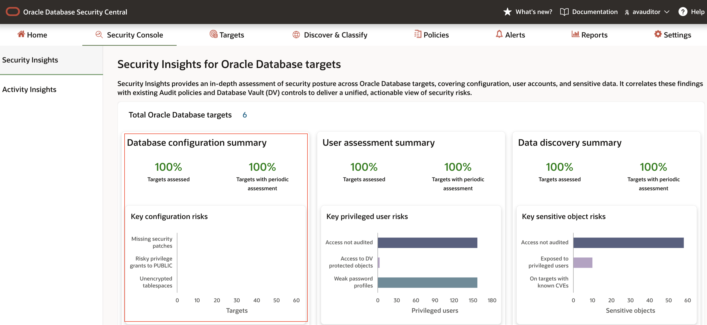 
        **Note**: Now, you can see that the risks in **Risky privilege grants to PUBLIC** are resolved. You may have to refresh the page few times to see the update. Review *Security Assessment* job status from *Settings tab -> Jobs* to see if it got completed.
    
8. Review the Drifts detected in **Security assessment drift detection**
        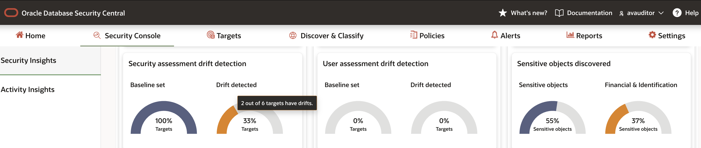

9. Click on the pipeline with drifts to see the popup showing the risks involving **grants to PUBLIC** mitigated 
    
    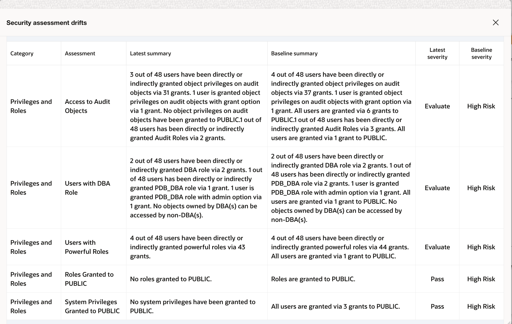 

    - Close the popup

    💡 **TIP:** You've now reviewed security configuration risks and mitigated them. Let's move on to identify potential user risks.

</details>

<details>
<summary>**Step 2: Evaluate user risks**</summary>

1. Review the key privilege user risks under **User assessment summary**
    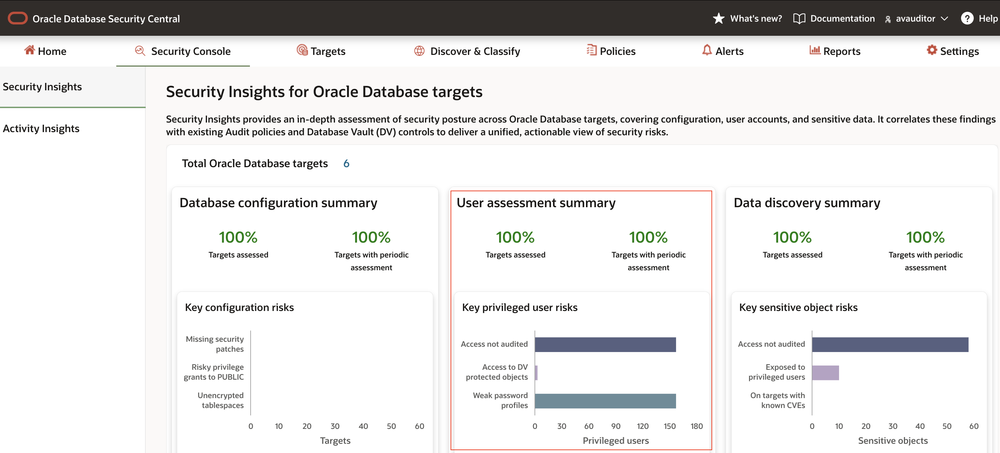

2. Drilldown into the data showing privileged users **Access not audited** 
    - Filter the report to show only database admins among the priveleged users
        - Make sure to filter the rows containing **Database admin = "Yes"**. You may have to toggle the column to display in *Actions dropdown -> Select Columns*
    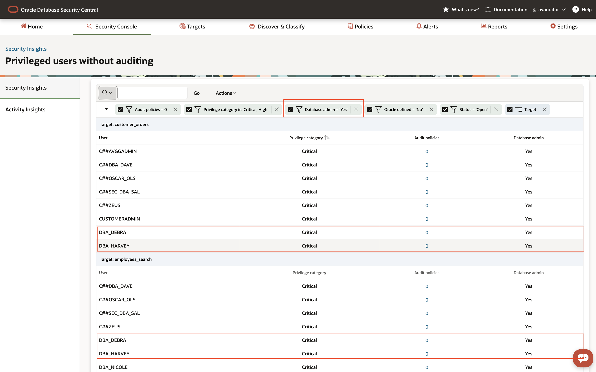

    **Note**: Database Administrators **`DBA_DEBRA`** and **`DBA_HARVEY`** have the broad database administrative rights on the entire fleet of databases. It is critical to audit database administrators and other privileged users, as their broad system privileges can pose significant risk if their credentials are compromised or misused. 
     
3. Click **Security Insights** to go back, then drilldown into the data showing privileged users **Access to DV protected objects**
    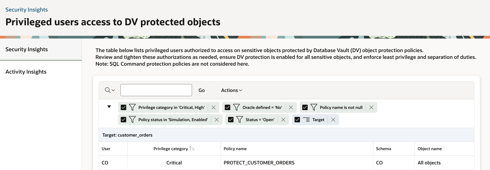  
     **Note**: Only schema owner has been granted access to the objects in the protected realm of **`customer_orders`** pdb. 

    💡 **TIP:** You've now identified privileged users who carry potential risks. Let's move on to understand sensitive data that faces risk of exposure.
</details>

<details>
<summary>**Step 3: Assess the sensitive data exposure risk** </summary>

1. Review the sensitive data access not audited under **Data discovery summary**

    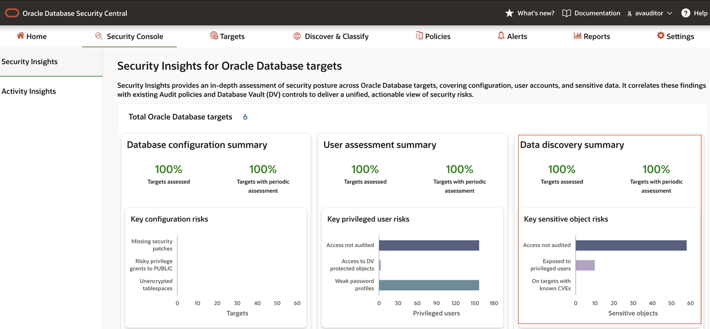 

2. Drilldown into the data showing sensitive data whose **Access not audited** 
    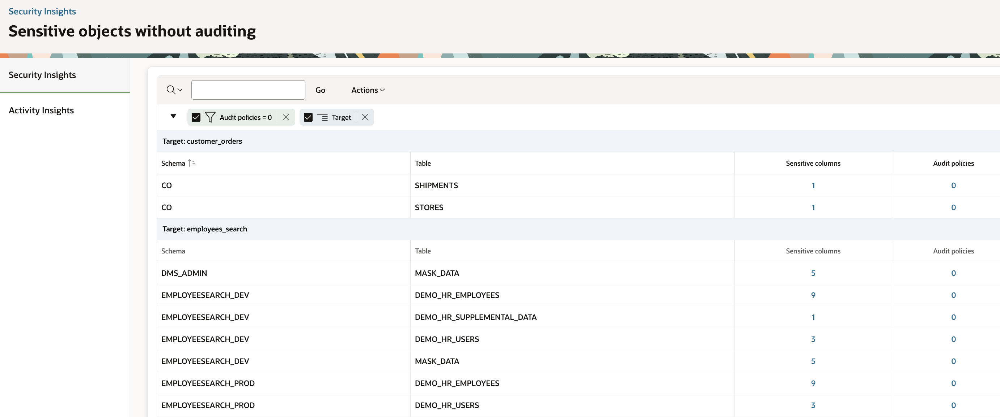
        **Note**: Access to sensitive data in **`employees_search`** and **`customer_orders`** pdbs are not audited. Ensuring proper visibility and governance over who can access sensitive data helps minimize risk, enforce accountability, and protect high-value information.

3. Go back to the **Security Insights** console, and drilldown into sensitive data **Exposed to privileged users**
    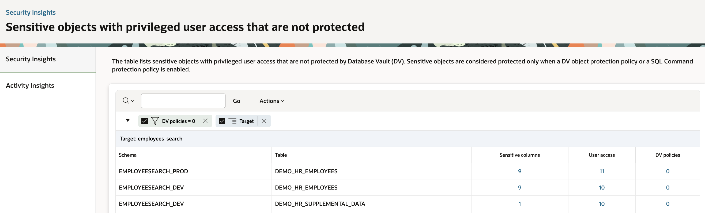
        **Note**: Access to sensitive data in **`employees_search`** pdb remains insufficiently protected, as privileged users can still directly access these objects, increasing the risk of misuse or unauthorized exposure. 

4. Go back to the **Security Insights** console 

    💡 **TIP:** You've now identified sensitive data that faces risk of exposure. Let's try to understand what powers these insights in **Security Central**
</details>

<details>
<summary>**Step 4: Review what powers these insights**</summary>

1. Go to the **Targets** tab

2. Click the **Schedule Retrieval Jobs** icon for the target **`employees_search`** 
    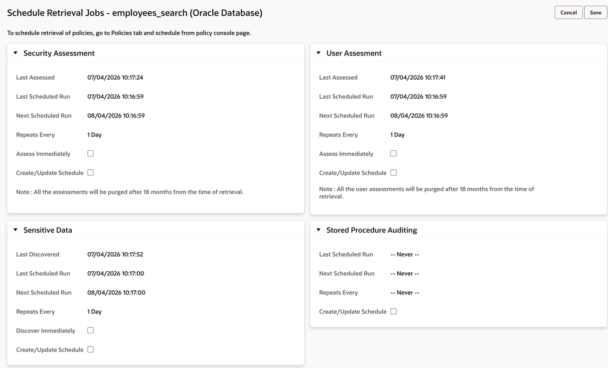

 **Note**: When a target is registered, **Security Central** automatically runs retrieval jobs for security assessment, user assessment and sensitive data discovery. You can consider scheduling the jobs to run periodically. In this livelab, we have automated daily retrieval.

💡 **TIP:** You've now assessed security risk posture - configuration risks, potential user risks, and the sensitive data exposture risks. Now let's understand the sensitive data landscape.
</details>

## Task 2: Review your sensitive data landscape

Sensitive Data Discovery dashboard provides a unified, fleet-wide view to identify database objects, such as tables and views that store sensitive information including PII, financial data, and health records. It organizes findings into sensitive categories, helping teams to quickly spot what kind of data is exposed to more risk. Within these categories, sensitive types define the specific detection patterns used to accurately identify particular kinds of sensitive data. The dashboard surfaces key insights such as discovery summaries, top targets by sensitive values, and distribution of sensitive data across the fleet by category and type. Together, these capabilities enable security teams to quickly assess exposure, prioritize mitigation efforts, and strengthen overall data protection posture.

<details>
<summary> **Step 1: Assess the sensitive data landscape** </summary>


1. Click on the **Discover & Classify** tab


2. Expand **Sensitive Data Discovery** in the left menu, and click on **Discovery Summary**

3. Review the **Sensitive data discovery** dashboard

    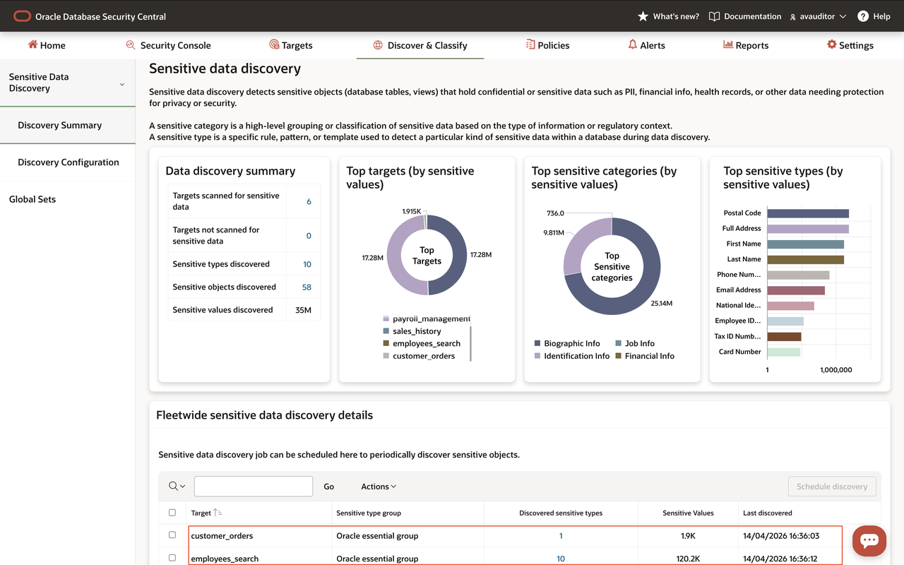

    **Note**: Pluggable databases **`employees_search`** and **`customer_orders`** do contain substantial concentration of sensitive data; therefore, we should prioritize implementing strong access controls to secure and govern access.

💡 **TIP:** Now that you understand your sensitive data landscape, let's understand the security policies present in the environment to protect the sensitive data.
</details>

## Task 3: Review your security policy landscape
The unified security policy console provides a centralized interface to define, manage, and enforce policies across the entire fleet. This streamlined console helps ensure consistent protection across the fleet and enables to identify potential gaps in policy enforcement.

<details> 
<summary>**Step 1: Review the unified security policy console**</summary>

1. Click on the **Policies** tab


2. Click **Policy console** in the left menu, and review the policies deployed

    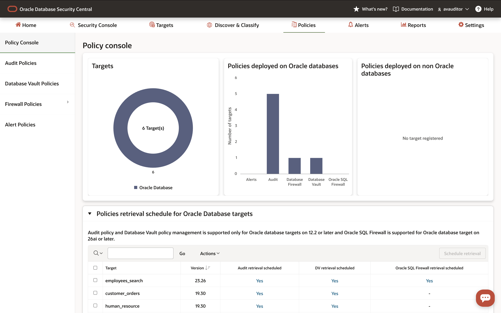
    - Drilldown into **Audit** data in the second chart showing policies deployed
    
3. Examine the audit policies enabled for **`customer_orders`**

    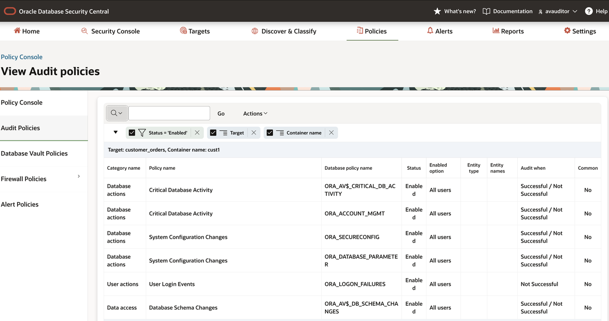
    **Note**: The list includes the audit policies enabled by default in the Oracle Database, and those enabled by automation in the livelab.

4. Go back to **Policy Console**

5. Scroll down to the **Policies retrieval schedule for Oracle Database targets** 

6. Select the target **`employees_search`** and click **Schedule retrieval**. Enter the following in the popup:
    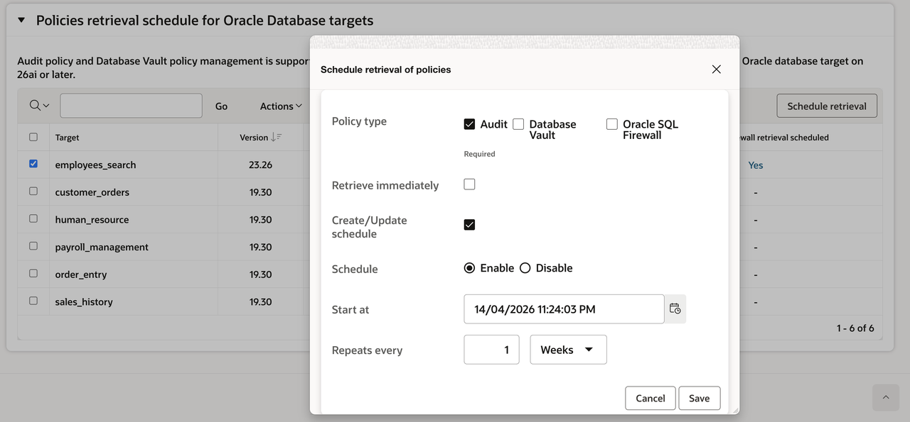
    - Select Policy type *Audit*
    - Select *Create/Update schedule*
    - Schedule *Enable*
    - Repeats every *1 week*
    - Click *Save*

    **Note**: When a target is registered, AVDF automatically runs retrieval job for policies. You should consider scheduling the job periodically to retrieve the latest. 

    💡 **TIP:** You know the security policies present in the environment and what is missing. Let's explore the building blocks to start configuring policies.

</details>

## Task 4: Review and leverage global sets 

Global set represents predefined collection of entities such as IP addresses, database users, OS users, client programs, database roles, sensitive schemas, privileged users, and sensitive objects, that can be centrally managed and reused across multiple policies and reports. This approach streamlines policy management, ensures consistency, and simplifies updates across the system.

<details>
<summary>**Step 1: Review and leverage the global sets**</summary>

1. Click on the **Discovery & Classify** tab

2. Click on the **Global Sets** is the left menu
    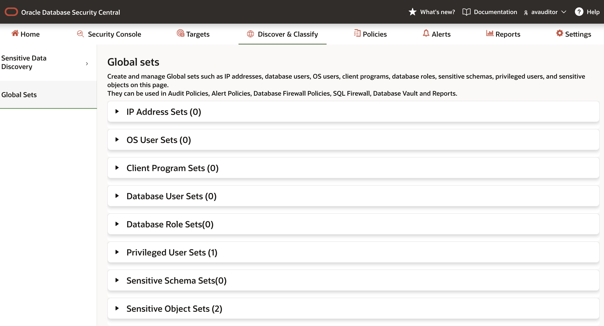  

    **Note:** Create and manage global sets like IP address, database user, operating system user, client program, privileged user, and sensitive object sets on this page. We have created couple of global sets in this livelab.
</details>

<details>
<summary> **Step 2: Review the Sensitive Object Set** </summary>

1. Expand **Sensitive Object Sets (2)** and click the one created for you: **EmployeeSearchSensitiveApplicationObjects**
    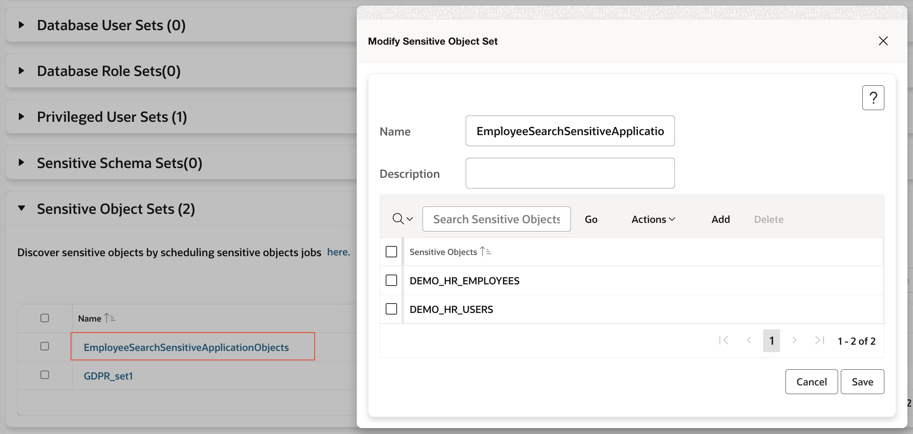 
    **Note:** This group represents a set of most sensitive objects in employees_search DB, and will be used later while creating policies. Consider creating such sets to simply the management of policies.
2. Close the popup.

</details>

<details>
<summary> **Step 3: Review the Privileged User Set**</summary>

1. Expand **Privileged User Sets (1)** and click the one created for you: **Database Administrators**
    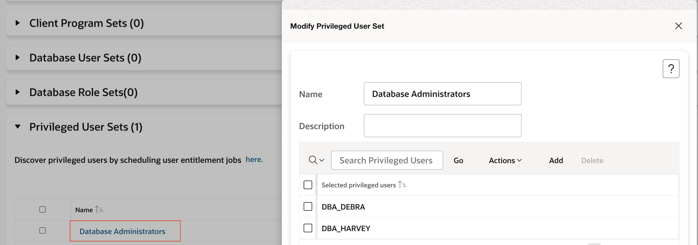 
    **Note:** This group represents the set of Database administrators who have broad system access in employees_search DB, and will be used later while creating policies. Consider creating such sets to simply the management of policies.
2. Close the popup.

</details>

## What did we learn in this lab
    
Assessing your database fleet is essential to identify configuration risks, detect potentially risky users, and uncover sensitive data that may be exposed. These insights enable you to prioritize actions and strengthen the overall security posture of your database environment.

In this lab, you learned how to:
- Assess Oracle Database security configurations and mitigate identified risks
- Identify potentially risky users with excessive privileges that could be misused or abused
- Discover sensitive data that may be at risk of exposure
- Locate sensitive objects within the environment to focus your efforts
- Understand your current security policy landscape
- Leverage global sets to streamline policy management, ensure consistency, and simplify updates across the system
>>>>>>> ecfd685b6409977b9a29d88ace059340a60acbbd

You may now **proceed to the next lab**.

## Acknowledgements
<<<<<<< HEAD
- **Author** - Nazia Zaidi, Audit Vault and Databse Firewall - Product Manager
- **Contributors** - Hakim Loumi - Hakim Loumi, Database Security - Product Manager
- **Last Updated By/Date** - Nazia Zaidi, Audit Vault and Databse Firewall - Product Manager - November 2024
=======
- **Author** - Angeline Dhanarani, Database Security - Product Manager
- **Contributors** - Nazia Zaidi, Database Security - Product Manager
- **Last Updated By/Date** - Angeline Dhanarani, Database Security - Product Manager - April 2026
>>>>>>> ecfd685b6409977b9a29d88ace059340a60acbbd
