<<<<<<< HEAD
# Oracle Audit Vault and DB Firewall (AVDF)

## Introduction
This workshop introduces the various features and functionality of Oracle Audit Vault and DB Firewall (AVDF). It gives the user an opportunity to learn how to configure those appliances in order to audit, monitor and protect access to sensitive data.

*Estimated Lab Time:* 110 minutes

*Version tested in this lab:* Oracle AVDF 20.13

### Video Preview

Watch a preview of "*LiveLabs - Oracle Audit Vault and Database Firewall*" [](youtube:eLEeOLMAEec)


### Objectives
- Assess the security posture of the registered Oracle database targets
- Set a baseline and detect drift of the security configuration
- Discover sensitive data
- Configure the auditing for the Oracle database
- Explore the interactive reporting capabilities, including user entitlement
- Simply compliance with pre-defined reports, including activity on sensitive data
- Train the DBFW for the authorized application query and prevent the SQL injection


### Prerequisites
This lab assumes you have:
- A Free Tier, Paid or LiveLabs Oracle Cloud account
- You have completed:
    - Lab: Prepare Setup (*Free-tier* and *Paid Tenants* only)
    - Lab: Environment Setup
    - Lab: Initialize Environment

### Lab Timing (estimated)


| Step No. | Feature | Approx. Time |
|--|------------------------------------------------------------|-------------|
|| **AVDF Labs**||
|04| Reset the password | <5 minutes|
|05| Assess and Discover | 20 minutes|
|06| Audit and Monitor | 20 minutes|
|07| Report and Alert | 20 minutes|
|08| Protect and Prevent | 20 minutes|
|| **Optional**||
|09| Advanced features configuration | 25 minutes|
|10| Reset the AVDF labs config | <5 minutes|

## Lab 6: Audit and Monitor

AVDF gives you visibility into database activity by collecting and aggregating audit data and network-based monitoring of SQL statements for the most popular relational databases. For Oracle databases, users can centrally manage and provision audit policies from AVDF.

In this lab, we will do the following
- Provision audit policy from AVDF on Oracle database
- Retrieve and monitor user entitlements

### Step 1: Manage and Provision audit policy from AVDF for Oracle databases pdb1 and pdb2

We have already configured the audit trail for the databases pdb1 and pdb2.

To showcase AVDF capabilities, we use **agent-based audit collection for pdb1** and **agentless collection for pdb2**.

You can see the same from "**Targets**" > "**Audit Trails**" (with **AVADMIN** login)

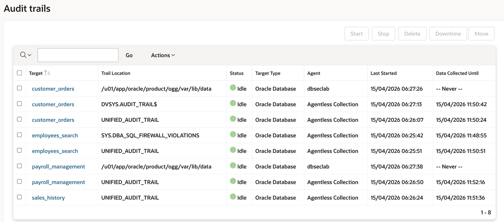

You will retrieve and provision the Unified Audit settings for the **pdb1** pluggable database

1. Go back to Audit Vault Web Console as *`AVAUDITOR`*

    

2. Click on the **Targets** tab

3. Click on **Schedule Retrieval Jobs** on **pdb1**

    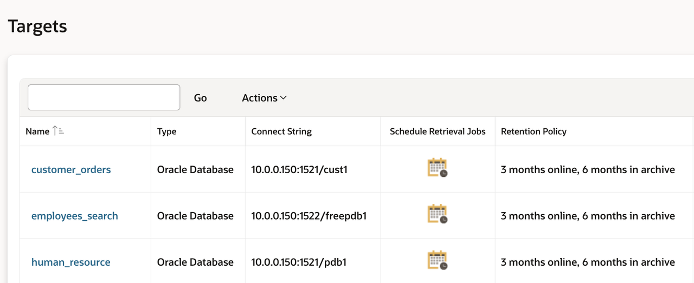

4. On the target screen, under **Audit Policy** perform the following:
    - Checkbox *Retrieve Immediately*
    - Checkbox *Create/Update Schedule*
    - Change the **Schedule** radio button to *Enable*
    - Set **Repeat Every** to *1 Days*
    - Then, click [**Save**] to save and continue

     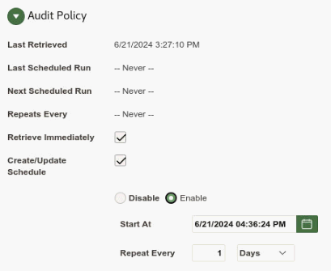

    **Note**: By default, retreival job has been already scheduled for **pdb2** during the deployment

5. Next, provision the audit policy for **pdb1**
    - Click on the **Policies** tab and you will be placed on the **Audit Policies** page
    - Click on the Target Name **pdb1**
    - On this screen, you will see two tabs, "Unified Auditing" and "Traditional Auditing"
    - In this lab we are using **Unified Auditing** tab, so go to the **Core Policies** section and ensure the following options are checkmarked
        - *`Critical Database Activity`*
        - *`Database Schema Changes`*
        - *`All Admin Activity`*
        - *`Center for Internet Security (CIS) Configuration`*

            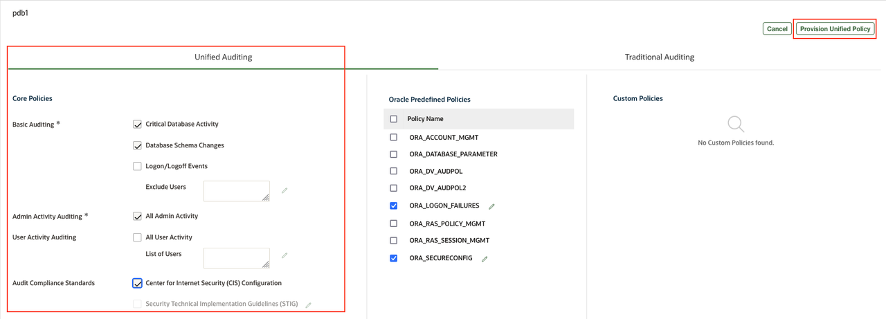

    - Click [**Provision Unified Policy**]


6. Verify the job completed successfully
    - Click on the **Settings** tab
    - Click on the **Jobs** section on the left menu bar
    - You should see at least one **Job Type** that says **Unified Audit Policy**

        

    - If not, please refresh the web page  (press [F5] for example) until it shows **Completed** and it was provisioned on **pdb1**

7. Repeat the steps 5 and 6 for **pdb2** as well

8. The next thing you can do is check which Unified Audit Policies exist and which Unified Audit Policies are enabled by using **SQL*Plus**

    - Go back to your terminal session and list **ALL** the Unified Audit Policies in **pdb1**

        ````
        <copy>./avs_query_all_unified_policies.sh pdb1</copy>
        ````

        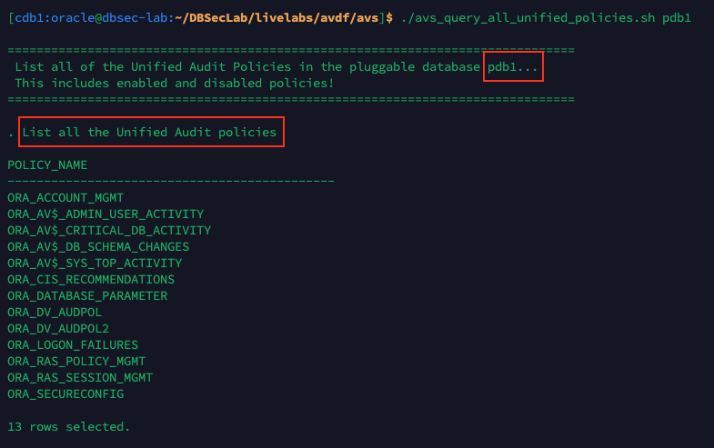

    - Next, show the **enabled** Unified Audit policies

        ````
        <copy>./avs_query_enabled_unified_policies.sh pdb1</copy>
        ````

        

9. If you want, you can re-do the previous steps and make changes to the Unified Audit Policies. For example, don't enable the **Center for Internet Security (CIS) Configuration** and re-run the two shell scripts to see what changes!

### Step 2: Retrieve and monitor user entitlements

1. Go back to the Home tab (Do not logout in stay logged as *`AVAUDITOR`*)

2. Click on the **Targets** tab

3. Click on **Schedule Retrieval Jobs** for **pdb1**

4. Under **User Entitlements**
    - Checkbox *Retrieve Immediately*
    - Checkbox *Create/Update Schedule*
    - Change the **Schedule** radio button to *Enable*
    - Set **Repeat Every** to *1 Days*
    - Click [**Save**] to save and continue

    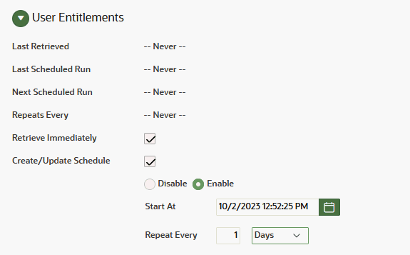

    **Note**: By default, retreival job has been already scheduled for **pdb2** during the deployment

5. Click on the **Reports** tab

6. Scroll down and expand the **Entitlement Reports** section

    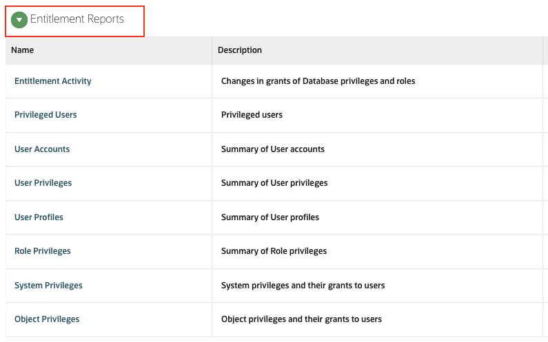

7. Click on the **User Accounts** report
    - Under **Target Name**, select *`All`*
    - For **Label**, select *`Latest`*
    - Click [**Go**] and you will see a report that looks like this

        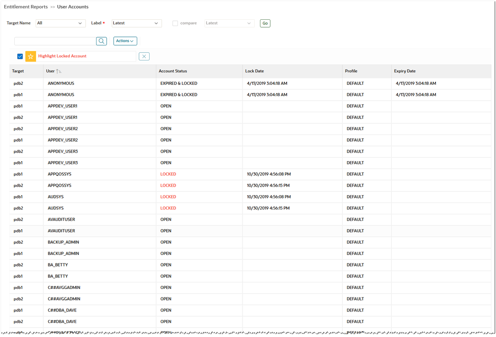

> #### What did we learn in this lab
>
>>- How to provision audit policy from AVDF on Oracle database
>>- How to schedule and monitor user entitlement
=======
# Establish visibility first: audit and monitor

## Introduction
Establishing visibility is the first step toward securing your database environment. With the necessary insights in place, shift your focus to first enable continuous monitoring to track user activity, detect anomalies, and understand how data is accessed and modified.

- The **employees_search** pdb supports internal self-service applications, and contains a high volume of sensitive data and is accessible to privileged users, making insider threat mitigation the top priority. You enable auditing to track security-relevant events, privileged user activity, and access to sensitive data.
- For the **customer_orders** pdb, the primary focus is mitigating external threats and demonstrating compliance. You enable auditing for system configuration changes, critical database activity, and schema changes, and additionally provision user activity and CIS compliance policies.

*Estimated Lab Time:* 10 minutes

*Version tested in this lab:* Oracle Database Security Central (Security Central)
<!--
### Video Preview

Watch a preview of "*LiveLabs - Oracle Database Security Central (Security Central)*" [](youtube:eLEeOLMAEec)
-->

### Objectives
- Configure database activity monitoring with audit
- Pro-actively monitor actionable audit events with alerts


## Task 1: Configure database activity monitoring with audit

Security Central enables comprehensive database activity monitoring by collecting and aggregating audit data, along with network-based monitoring of SQL traffic. For Oracle Database, it provides centralized capabilities to manage and provision audit policies, ensuring consistent monitoring, improved visibility, and stronger security governance across the database environment.
<details>
<summary> **Step 1: Ensure audit trails are configured** </summary>

Audit trails represent collection endpoints for database activity events. They gather audit data from multiple sources, normalize and centralize it for monitoring and analysis. 

1. Examine the audit trails that we have already configured for you in this livelab:
    - You can see them from **Targets** tab > "**Audit Trails**" menu (with **AVADMIN** login)
        
        **Note:** Ensure the trails are either in **Collecting** or in **Idle** state in your lab.

</details>

<details>
<summary> **Step 2: Provision audit policies for employees_search pdb** </summary>

1. Go to Security Central Console as *`AVAUDITOR`*

2. Click on the **Policies** tab, and **Audit Policies** in the left menu
    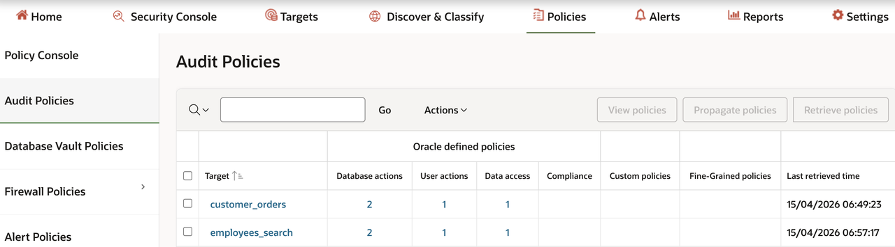

    **Note**: If the **Last Retrieved time** is *Never*, select the **`employees_search`** pdb and click **Retrieve policies** to retrieve the latest from the database.You can schedule the periodical retrieval following *Lab5->Task3->Step2*.

3. Click on **employees_search** pdb to review the policies enabled
    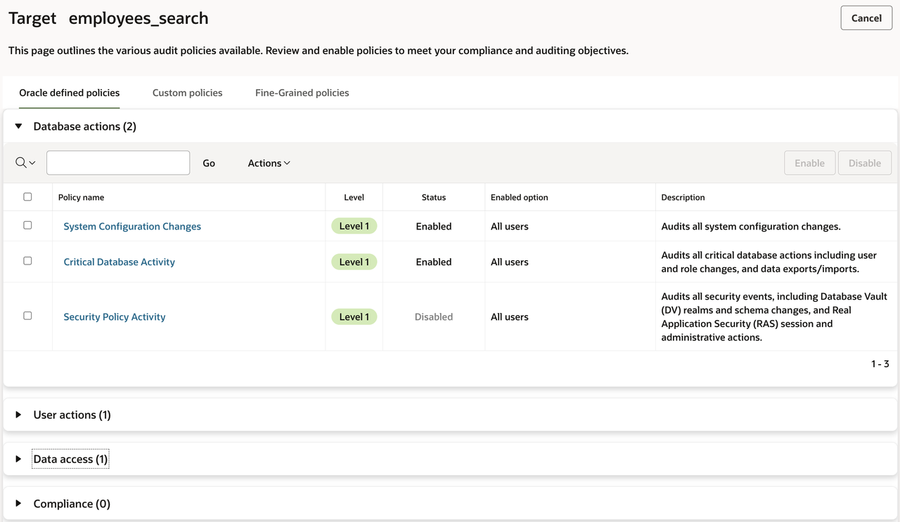

    **Note**: We have enabled few audit policies like **System Configuration Changes**, **Critical Database Activity**, **User Login Events**, and **Database Schema changes** in the livelab instance. 

4. Provision the audit policy to track **privileged user activity**
    - Expand **User Actions**
    - Click **User Activity**
    - Use the defaults for *Policy enable condition*. Make sure this is selected: *Privileged users identified by User Assessment*
        
        - Click **Enable** and review to see the status as **Enabled** in the policies page. You may have to refresh the page couple of times till it reflects.

5. Next, provision the audit policy to track **sensitive data access**
    - Expand **Data access**
    - Click **Sensitive Data Access Monitoring**
    - Unselect checkbox **Audit SELECT operations**
    - Ensure this is checked **Sensitive objects discovered by sensitive data discovery**
        
    - Enable policies for all users except Application service account (`EMPLOYEESEARCH_PROD`)
         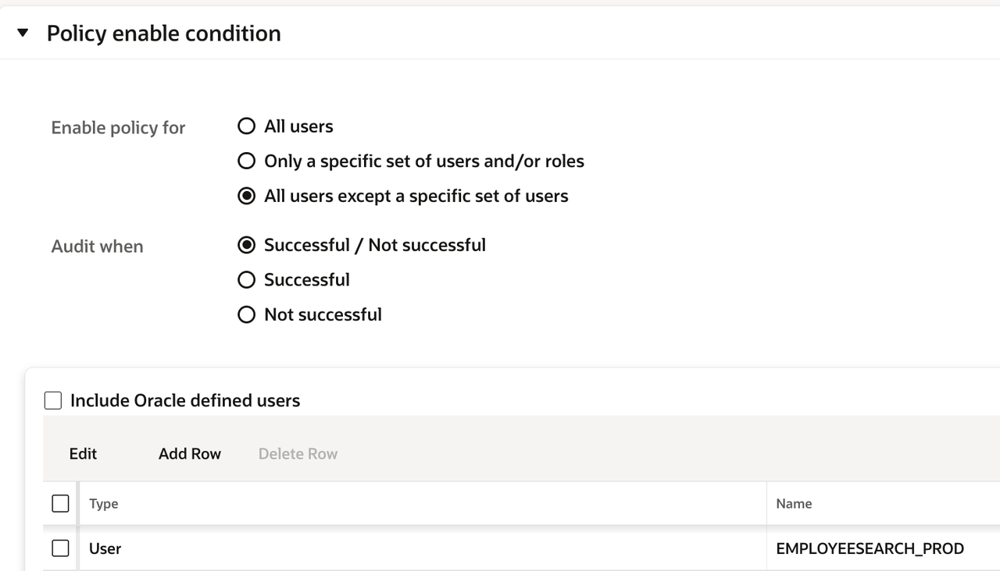
         - Select *Enable policy for* checbox as **All users except a specific set of users** 
         - Click **Add Row**, select **User** as Type, and select **`EMPLOYEESEARCH_PROD`** from the dropdown
    - Click **Enable** and review to see the status as **Enabled** in the policies page. You may have to refresh the page couple of times till it reflects.

6. Go back to **Audit Policies** 


    💡 **TIP:** Unified audit policies in Oracle Database define what database activities should be audited. They can be provisioned and managed from Security Central.

</details>

<details>
<summary> **Step 3: Provision audit policies for customer_orders pdb**</summary>

1. Click on **customer_orders** pdb to review the policies enabled
    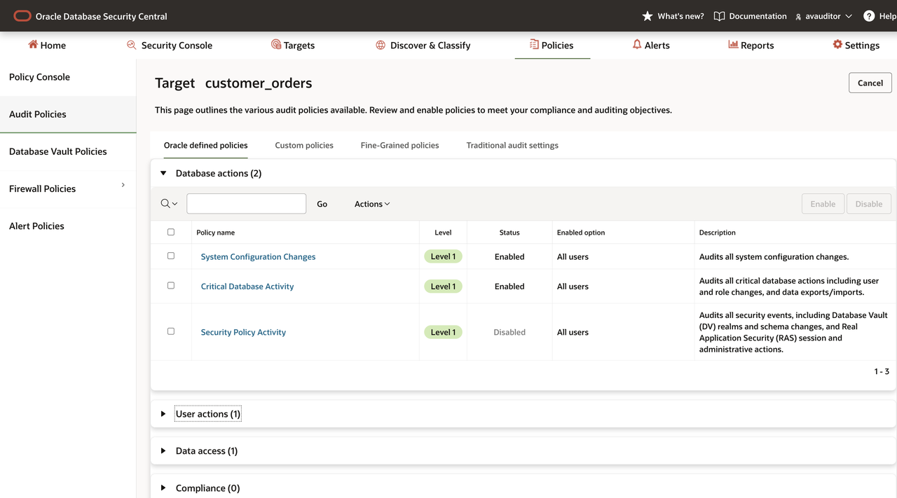

    **Note**: We have enabled few audit policies like **System Configuration Changes**, **Critical Database Activity**, and **Database Schema changes** in the terraform for the livelab instance. 

2. Provision the audit policy to track **privileged user activity**
    - Expand **User Actions**
    - Click **User Activity**
    - Use the defaults for *Policy enable condition*.
        
    - Click **Enable** and review to see the status as **Enabled** in the policies page

3. Provision the audit policy to help comply with CIS compliance
    - Expand **Compliance**
    - Select **Center for Internet Security (CIS) Configuration** and click **Enable**
        

4. Go back to **Audit Policies** and review the policies for **`employees_search`** and **`customer_orders`** pdb
      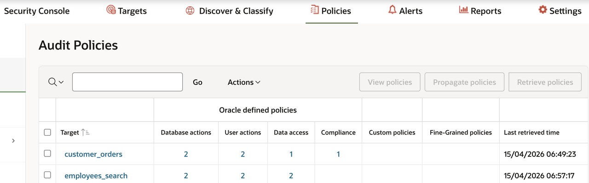
</details>

<details>
<summary> **Step 4: Ensure the audit policy provisioning succeeds**</summary>

1. Click on the **Settings** tab
    - Click on the **Jobs** section on the left menu
    - You should see **Job Type** that says **Provision Audit Policies**. The status should be set to **Completed**.

        
        **Note:** If not, please refresh the web page  (press [F5] for example) until it shows **Completed** and it was provisioned on **`employees_search`** and **`customer_orders`**

2. Ensure the Unified Audit policies are enabled on the target using **SQL*Plus**

    - Go back to your terminal session and show the **enabled** Unified Audit policies in **`employee_search`** 

        ````
        <copy>./avs_query_enabled_unified_policies.sh freepdb1</copy>
        ````

        
        **Note:** Repeat the query for **`customer_orders`** pdb and confirm

        ````
        <copy>./avs_query_enabled_unified_policies.sh cust1</copy>
        ````


    💡 **TIP:** You have provisioned unified audit policies on the target database to generate audit events for tracked actions. Next, you will learn how to turn them into actionable alerts for monitoring and response, once these are collected in **Security Central** through audit trails.

</details>

## Task 2: Pro-actively monitor actionable audit events using alerts

<details>
<summary> **Step 1: Provision alert policy**</summary>

1. Click on the **Policies** tab, and click the **Alert Policies** sub-menu on the left

2. Create the alert policy "**Alert whenever there is a user created, dropped or altered**"

    - Click [**Create**]

    - Enter the following information for the new **Alert**

        - Alert policy name: *`User creation/modification`*
        - Description: *`Alert when the user is created, dropped, or altered`*
        - Target type: *`Oracle Database`*
        - Severity: *`Warning`*
        - Condition: Click on **"Copy conditions from examples"** and copy condition **"User creation/modification"**
            
            
    
        - Threshold (times): *`1`*

        **Note:** (Optional)You can also enable email notification for the alerts. 
        - Select **Enable email notification** and provide email address
        - **You need to have SMTP server** configured for the email notification. If you have it configured, you can check it out.

    - Your Alert should look like this.

        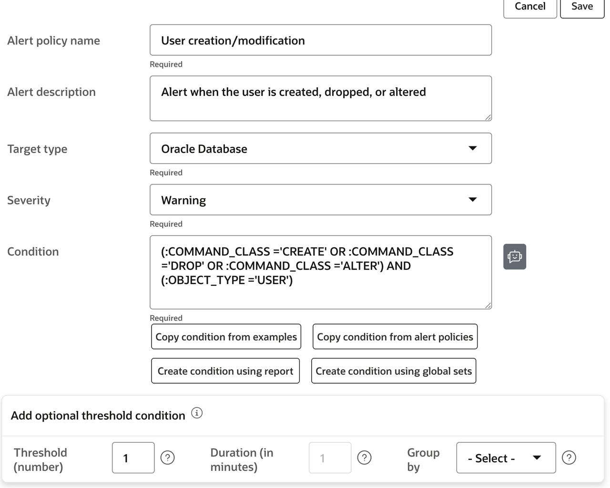

    - Click [**Save**]

        **Note:** Your Alert is automatically enabled!


3. To trigger alerts, go back to your terminal session on DBSeclab VM and create users within the **`employees_search`** and **`customer_orders`** pluggable databases

    ````
    <copy>
    ./avs_create_users.sh cust1
    </copy>
    ````

    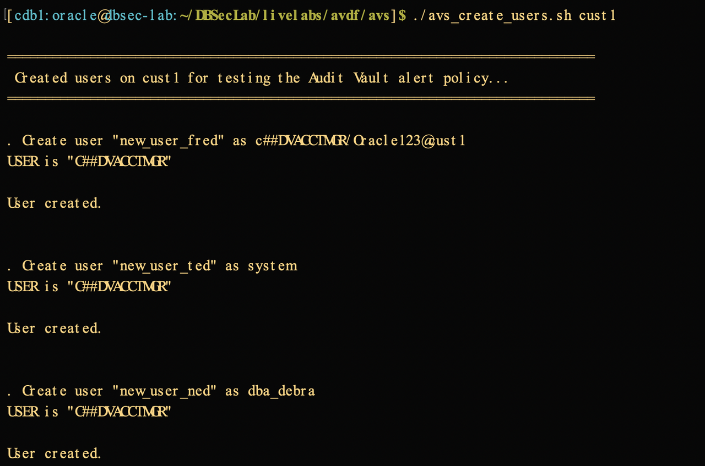

    - Repeat the same for **`employees_search`** pdb
    
    ````
    <copy>
    ./avs_create_users.sh freepdb1
    </copy>
    ````

    - Run another script to drop the users we created in the previous script

    ````
    <copy>
    ./avs_drop_users.sh cust1
    </copy>
    ````

    
    
    - Repeat the same for **`employees_search`** pdb
    
    ````
    <copy>
    ./avs_drop_users.sh freepdb1
    </copy>
    ````

</details>

<details>
<summary>**Step 2: Review the alerts generated**</summary>

1. Click on **Alerts** tab in the console

2. View the Alerts that have occurred related to the user creation/deletion SQL commands

    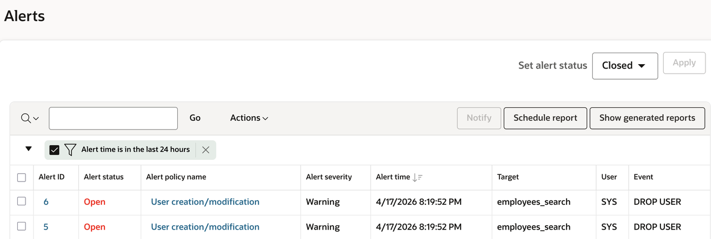

    **Note**: If you don't see them, refresh the page. 

</details>

## What did we learn in this lab

Establishing visibility is the first step toward securing your database environment. By enabling auditing and continuous monitoring, you can track user activities, detect anomalies, and understand how data is accessed and modified. Configuring alerts ensures that suspicious or policy-violating actions are promptly brought to attention, enabling faster response and mitigation. Together, auditing, monitoring, and alerting create a strong foundation for proactive security.

In this lab, you learned how to:
- Provision unified audit policies from Security Central for Oracle Databases
- Proactively monitor audit events and respond to them using actionable alerts
>>>>>>> ecfd685b6409977b9a29d88ace059340a60acbbd

You may now **proceed to the next lab**.

## Acknowledgements
<<<<<<< HEAD
- **Author** - Nazia Zaidi, Audit Vault and Databse Firewall - Product Manager
- **Contributors** - Hakim Loumi - Hakim Loumi, Database Security - Product Manager
- **Last Updated By/Date** - Nazia Zaidi, Audit Vault and Databse Firewall - Product Manager - November 2024
=======
- **Author** - Angeline Dhanarani, Database Security- Product Manager
- **Contributors** - Nazia Zaidi, Database Security - Product Manager
- **Last Updated By/Date** - Angeline Dhanarani, Database Security - Product Manager - April 2026
>>>>>>> ecfd685b6409977b9a29d88ace059340a60acbbd
