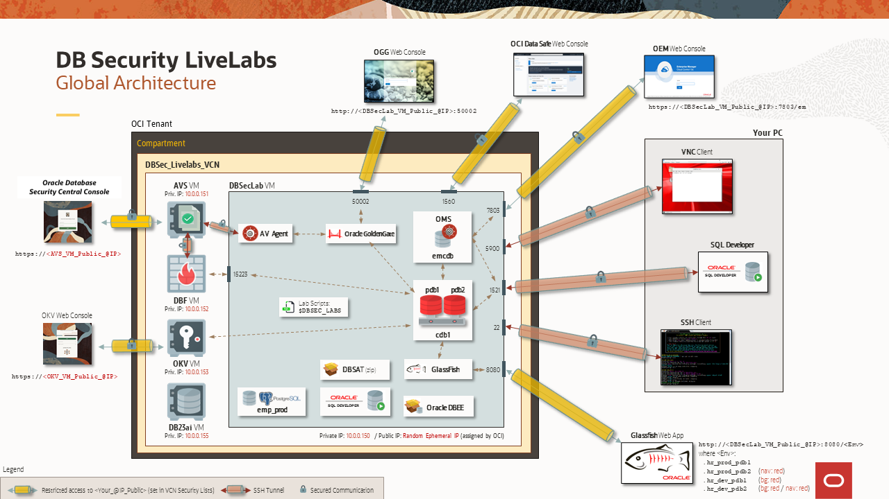

# Introduction

## About this Workshop
### Overview
<<<<<<< HEAD
*Estimated Time to complete the workshop*: 55 minutes

<<<<<<<< HEAD:database/advanced/intro/intro-avdf.md
This workshop environment is dedicated to Oracle Database Security features and functionalities.
========
This workshop is the SECOND of two Hands-On Labs dedicated to encrypting data at rest within the Oracle Database. The first workshop, DB Security – ASO (Transparent Data Encryption & Data Redaction) covers transparent data encryption (TDE). This second workshop covers the important topic of managing encryption keys. Here, we will migrate an encrypted database to Oracle Key Vault for centralized key management and walk through a typical Key Vault deployment.
>>>>>>>> ecfd685b6409977b9a29d88ace059340a60acbbd:database/advanced/intro/intro-key-vault.md

Based on an OCI architecture, deployed in a few minutes with a simple internet connection, it allows you to test DB Security use cases in a complete environment already pre-configured by the Oracle Database Security Product Manager Team.
=======
*Estimated Time to complete the workshop*: 60 minutes

Oracle Database Security Central (Security Central) is one command center providing unified view of risk, sensitive data, policy governance, activity monitoring, and SQL threat prevention for the fleet of databases in your environment. Security Central is designed to complement existing database protection technologies like encryption, auditing, fine-grained authorization, multi-factor authentication, and privileged access controls. Together, they create a layered, defense-in-depth approach:
  - Prevent unauthorized access
  - Protect sensitive data
  - Monitor and audit activity
  - Continuously assess for risk and drift

This workshop environment is dedicated to Oracle Database Security features and functionalities. In this workshop, you as a security administrator are tasked with improving the security posture of a growing fleet of Oracle databases, containing sensitive data.  

Based on an OCI architecture, deployed in a few minutes with a simple internet connection, it allows you to experience Security Central use cases in a complete environment already pre-configured by the Oracle Database Security Product Manager Team.
>>>>>>> ecfd685b6409977b9a29d88ace059340a60acbbd

Now, you no longer need important resources on your PC (storage, CPU or memory), nor complex tools to master, making you completely autonomous to discover at your rhythm all new DB Security features.

### Components
The complete architecture of the **DB Security Hands-On Labs** is as following:

<<<<<<< HEAD
  

It's composed of 5 VMs:
=======
  

It's composed of multiple VMs, including:
>>>>>>> ecfd685b6409977b9a29d88ace059340a60acbbd
  - **DBSec-Lab VM** (mandatory for all workshops: Baseline and Advanced workshops)
  - **Audit Vault Server VM** (for Advanced workshop only)
  - **DB Firewall Server VM** (for Advanced workshop only)
  - **Key Vault Server VM** (for Advanced workshop only)
<<<<<<< HEAD
  - **DB23ai VM** (for SQL Firewall workshop only)

During this mini-lab, you'll use different resources to interact with these VMs:
  - SSH Terminal Client
<<<<<<<< HEAD:database/advanced/intro/intro-avdf.md
  - Glassfish HR App
  - Oracle Golden Gate Web Console
  - Oracle AVDF Web Console
  - (Optionally) SQL Developer
========
  - Oracle Key Vault Web Console
>>>>>>>> ecfd685b6409977b9a29d88ace059340a60acbbd:database/advanced/intro/intro-key-vault.md
=======

During this mini-lab, you'll use different resources to interact with these VMs:
  - SSH Terminal Client
  - Glassfish HR App
  - Oracle Golden Gate Web Console
  - Security Central Console
  - (Optionally) SQL Developer
>>>>>>> ecfd685b6409977b9a29d88ace059340a60acbbd

So that your experience of this workshop is the best possible, DO NOT FORGET to perform "Lab: *Initialize Environment*" to be sure that all these resources are correctly set!

### Objectives
This Hands-On Labs give the user an opportunity to learn how to configure the DB Security features to protect and secure their databases from the Baseline to the Maximum Security Architecture (MSA).

<<<<<<< HEAD
In this mini-lab, you will learn how to use the **Oracle Key Vault** (OKV) features.

The entire DB Security PMs team wishes you an excellent workshop!
=======
In this mini-lab, you will learn how to use the **Security Central** features.

The entire DB Security PMs Team wishes you an excellent workshop!
>>>>>>> ecfd685b6409977b9a29d88ace059340a60acbbd

You may now [proceed to the next lab](#next).

## Acknowledgements
<<<<<<< HEAD
<<<<<<<< HEAD:database/advanced/intro/intro-avdf.md
- **Author** - Hakim Loumi, Database Security PM
- **Contributors** - Angeline Dhanarani, Nazia Zaidi, Rene Fontcha
- **Last Updated By/Date** - Hakim Loumi, Database Security PM - January 2024
========
- **Author** - Shubham Goyal
- **Contributors** - Peter Wahl, Rahil Mir
- **Last Updated By/Date** - Shubham Goyal - October 2025
>>>>>>>> ecfd685b6409977b9a29d88ace059340a60acbbd:database/advanced/intro/intro-key-vault.md
=======
- **Author** - Angeline Dhanarani, Database Security PM
- **Contributors** - Angeline Dhanarani, Nazia Zaidi, Rene Fontcha
- **Last Updated By/Date** - Angeline Dhanarani, Database Security PM - April 2026
>>>>>>> ecfd685b6409977b9a29d88ace059340a60acbbd
