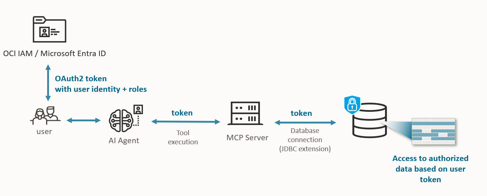

# Introduction

## About this Workshop
### Overview
*Estimated Time to complete the workshop*: 75 minutes

This workshop environment is dedicated to Oracle Database Security features and functionalities.

Based on an OCI architecture, deployed in a few minutes with a simple internet connection, it allows you to test DB Security use cases in a complete environment already pre-configured by the Oracle Database Security Product Manager Team.

Now, you no longer need important resources on your PC (storage, CPU or memory), nor complex tools to master, making you completely autonomous to discover at your rhythm all new DB Security features.

### Components
The architecture of this **Oracle Deep Data Security** Hands-On Lab is as following:

  

Users authenticate with Microsoft Entra ID. The database enforces per-user access with data grants — no application filtering required.

During this mini-lab, you'll use different resources to interact with the database:
  - SSH Terminal Client
  - (Optionally) SQL Developer

So that your experience of this workshop is the best possible, DO NOT FORGET to perform "Lab: *Initialize Environment*" to be sure that all these resources are correctly set!

### Objectives
This Hands-On Lab gives the user an opportunity to learn how to configure **Microsoft Entra ID** authentication for Oracle AI Database 26ai and layer **Oracle Deep Data Security** — end users, data roles, and data grants — so the database enforces per-user access based on Entra ID app role assignments.

The entire DB Security PMs Team wishes you an excellent workshop!

You may now [proceed to the next lab](#next)

## Acknowledgements
- **Author** - Database Security Product Development
- **Contributors** - Database Security Product Development
- **Last Updated By/Date** - Database Security Product Development - April 2026
