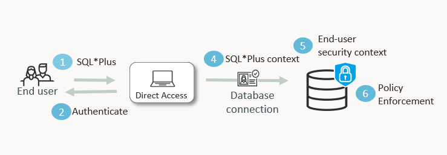

# Identity-aware database access using Oracle Deep Data Security and End Users

Welcome to this **Oracle Data Grants LiveLabs FastLab** workshop.

LiveLabs FastLab workshops give you clear, step-by-step instructions to help you quickly gain hands-on experience. You will go from beginner to confident user in a short time.

Estimated Time: 25 minutes

## The Challenge

AI copilots and agentic applications are transforming the enterprise, but many never make it past the security review. The use case is clear, but when sensitive data is involved, everything stalls. Security teams can't sign off. Data owners won't grant access. The blocking question is always the same: *how do you guarantee the AI agent only shows each user what they're authorized to see?*

Consider a copilot built on your company's HR data. Marvin, a manager of a team of three, asks *"What's the salary breakdown for my team?"* — he should see his direct reports and his own record. Emma, on Marvin's team, asks *"Show me my employee details"* — she should see only herself. 

Oracle AI Database 26ai Deep Data Security (Oracle Deep Data Security) solves this within the kernel of the database. With Deep Data Security, there are no proxies to route traffic through, no agents on the operating system to manage, nothing that bolts on to the database. The controls are declarative, identity-aware, and enforced before data ever leaves the database engine. The agent never sees restricted data — it physically cannot be retrieved. Guardrails protect the conversation; data grants protect the data itself. Your security team gets a control they can verify, and your AI project gets unblocked.

In 30 minutes, you'll see how Deep Data Security can help secure your data in the new Agentic AI world. 

## FastLab Introduction

### Prerequisites

This lab assumes the following are already configured:

- An **Oracle AI Database 26ai** instance (Autonomous or on-premises)
- You are connected as a database user for the setup tasks, privileges include:
      - CREATE USER
      - CREATE DATA ROLE
      - CREATE DATA GRANT
      - CREATE TABLE
      - GRANT QUOTA ON a TABLESPACE

<< Insert image of what the directory and application would look like >>

### What You Will Build



Same agent. Same SQL query. Different data — enforced by the database.

### How Identity Mapping Works — and Why It Matters

In a traditional database, you create database users and grant them privileges directly. But AI agents shouldn't work that way. A single AI agent connects to the database on behalf of **many** users — Marvin, Emma, and everyone else. Without an extra layer, the agent's service account sees all the data, and you're trusting application code to filter correctly. That trust is fragile: a prompt injection, misconfiguration, or a bug, and sensitive data leaks.

Oracle 26ai solves this with **Oracle Deep Data Security** — controls that are declarative, identity-aware, and enforced before data ever leaves the database engine:

## How Oracle Deep Data Security works

### End Users

Oracle Database end users are a new class of identity — distinct from traditional database schema users. They authenticate directly to the database with a password, but do not own schemas or objects. Deep Data Security ensures that end users and non-human identities (including agents) operate with least privilege and are monitored through centralized auditing. This enables organizations to adopt agentic AI with stronger security, privacy, and regulatory controls without making traditional guardrails the primary line of defense.

When you look at the session for Emma or Marvin, you will query the usual pseudo columns, functions, and user context. You will notice that your landing spot is not a dedicated schema named Marvin, nor is it a shared schema like you would find in Enterprise User Security (EUS) or Centrally Managed Users (CMU), but a null schema (`XS$NULL`) instead. `XS$NULL` acts as a placeholder for database sessions that do not have a corresponding database schema user, often used to indicate an active application user session in Oracle Deep Data Security or Oracle Real Application Security. It has no privileges and cannot own objects.

### Data Roles

In the Oracle AI Database, you will create data roles that are assigned to Oracle Database end users. End Users are not traditional Oracle Database users but a different class of user to match Data Roles and Data Grants. When you write `CREATE DATA ROLE HRAPP_MANAGERS` and grant it to an end user, Oracle activates `HRAPP_MANAGERS` automatically when that end user authenticates.

This means no manual grants and no application logic changes because the mapping is declarative and enforced by the new data roles and data grants mechanisms in the Oracle AI Database kernel.

### Data Grants

Data grants define which DML and SELECT operations are possible by the data role. They can be broad, such as `SELECT` or they can be fine grained to specific columns such as `UPDATE(PHONE_NNUMBER)`. 

Next, a data grant predicate defines the limitations the rows returned to the end user. For example, this data grant allows the user to SELECT specific columns but only update `PHONE_NUMBER`. The predicate uses the new `ora_end_user_context` to identify the user by their *end user* identity and restrict the rows returned to only rows that match their identity.

      ```
      CREATE OR REPLACE DATA GRANT hr.HRAPP_EMPLOYEES_ACCESS
        AS SELECT (employee_id, first_name, last_name, user_name, department_id, manager_id, ssn, phone_number), UPDATE(phone_number)
        ON hr.employees
        WHERE upper(user_name) = upper(ora_end_user_context.USERNAME)
        TO HRAPP_EMPLOYEES;
      ```

At runtime, Deep Data Security evaluates policies and modifies queries and other operations transparently from application logic to apply controls. As an ABAC system, this means that Deep Data Security acts as the policy decision point (PDP) and the database SQL engine as the policy enforcement point (PEP). End users can access only authorized data, irrespective of the SQL executed by an agent or application, mitigating prompt and SQL injection attacks. 

### Why this is important

This is important because it creates an **unbroken trust chain**: end user authentication → Oracle data role → data grant enforcement. No single layer can be bypassed independently.

In this lab, you will create two end users and two data roles, grant the roles to the appropriate end users, then attach data grants that define which rows and columns each data role can access or modify.

## Task 1: Create the HR schema and sensitive employee data

**The Scenario:** Your AI copilot will query an HR employees table that contains sensitive data — Social Security numbers, salaries, and a management hierarchy. You need a test environment that mirrors your production data so you can demonstrate per-user access control.

> **Connection:** Run Tasks 1 and 2 as a DBA user (e.g., `SYSTEM`) — not SYS — unless a step explicitly says otherwise. One step in Task 2 requires `SYS as SYSDBA` because it creates a data grant on a SYS-owned internal table. All other steps work with any account that has the DBA role.

1. Create a schema-only account for the HR data and a table with sample employees
      
- Create the `HR` schema and the `EMPLOYEES` table and `INSERT` the rows
      ```
      <copy>
      CREATE USER hr NO AUTHENTICATION;
      GRANT UNLIMITED TABLESPACE TO hr;

      CREATE TABLE hr.employees (
      employee_id   NUMBER PRIMARY KEY,
      first_name    VARCHAR2(50),
      last_name     VARCHAR2(50),
      job_code      VARCHAR2(10),
      department_id NUMBER,
      ssn           VARCHAR2(20),
      photo         BLOB,
      phone_number  VARCHAR2(30),
      salary        NUMBER(10,2),
      user_name     VARCHAR2(128),
      manager_id    NUMBER);

      -- CEO
      INSERT INTO hr.employees VALUES (1, 'Grace', 'Young', 'CEO', NULL, '111-11-1111', NULL, '555-100-0001', 235000, 'grace', NULL);

      -- Manager
      INSERT INTO hr.employees VALUES (2, 'Marvin', 'Morgan', 'SWE_MGR', 1, '222-22-2222', NULL, '555-100-0002', 175000, 'marvin', 1);

      -- Marvin's team
      INSERT INTO hr.employees VALUES (3, 'Emma', 'Baker', 'SWE2', 1, '333-33-3333', NULL, '555-100-0003', 120000, 'emma', 2);
      INSERT INTO hr.employees VALUES (4, 'Charlie', 'Davis', 'SWE1', 1, '444-44-4444', NULL, '555-100-0004', 95000, 'charlie', 2);
      INSERT INTO hr.employees VALUES (5, 'Dana', 'Lee', 'SWE3', 1, '555-55-5555', NULL, '555-100-0005', 130000, 'dana', 2);

      -- Other departments
      INSERT INTO hr.employees VALUES (6, 'Bob', 'Smith', 'SALES_REP', 2, '666-66-6666', NULL, '555-100-0006', 145000, 'bob', 1);
      INSERT INTO hr.employees VALUES (7, 'Fiona', 'Chen', 'HR_REP', 3, '777-77-7777', NULL, '555-100-0007', 92000, 'fiona', 1);

      COMMIT;

       </copy>
      ```

2. Verify you can see all the data, including SSNs and the management hierarchy.

      ```
      <copy>
      SELECT employee_id, first_name, last_name, ssn, salary, department_id, manager_id   
        FROM hr.employees
       ORDER BY employee_id;
      </copy>
      ```

      You should see all 7 rows with full SSN values and the reporting chain. Right now, anyone with access to this table sees everything — every employee SSN, every salary, across every department. Your AI agent would expose all of this for every user it serves. That is the problem you are about to fix.

      | EMPLOYEE\_ID | FIRST\_NAME | LAST\_NAME | SSN | SALARY | DEPARTMENT\_ID | MANAGER\_ID |
      |---|---|---|---|---|---|---|
      | 1 | Grace | Young | 111-11-1111 | 235000 | | |
      | 2 | Marvin | Morgan | 222-22-2222 | 175000 | 1 | 1 |
      | 3 | Emma | Baker | 333-33-3333 | 120000 | 1 | 2 |
      | 4 | Charlie | Davis | 444-44-4444 | 95000 | 1 | 2 |
      | 5 | Dana | Lee | 555-55-5555 | 130000 | 1 | 2 |
      | 6 | Bob | Smith | 666-66-6666 | 145000 | 2 | 1 |
      | 7 | Fiona | Chen | 777-77-7777 | 92000 | 3 | 1 |

## Task 2: Create end users, data roles and data grants

**The Key Step:** In this step, you'll create Oracle Database end users, create data roles, grant those roles to the end users, then define data grants that control exactly which rows and columns each role can access — or modify. This is where you enforce the security policy at the database layer.

1. Create two end users, Marvin and Emma. Marvin is a manager and Emma is an employee. 

      ```
      <copy>
      create end user marvin identified by Oracle123;
      create end user emma identified by Oracle123;
      </copy>
      ```

2. Create two data roles. 

      ```
      <copy>
      CREATE OR REPLACE DATA ROLE hrapp_employees;
      CREATE OR REPLACE DATA ROLE hrapp_managers;
      </copy>
      ```
      
      The purpose of these two roles will be to provide the following access based on the end user's role:
      - `HRAPP_EMPLOYEES` provides `SELECT` privileges, on specific columns, and return only the employee\'s own row of data. 
      - `HRAPP_MANAGERS` provides `SELECT` and `UPDATE` privileges but only on specific columns.

3. Grant the data roles to the end users based on their roles in the organization.

      - Emma is an employee

      ```
      <copy>
      grant data role hrapp_employees to emma;
      </copy>
      ```

      - Marvin is both an employee and a manager

      ```
      <copy>
      grant data role hrapp_employees to marvin;
      grant data role hrapp_managers to marvin;
      </copy>
      ```


2. Verify the data roles and their mappings.

      ```
      <copy>
      SELECT data_role, mapped_to, enabled_by_default
        FROM dba_data_roles
       WHERE data_role IN ('HRAPP_EMPLOYEES', 'HRAPP_MANAGERS');
      </copy>
      ```

      | DATA\_ROLE | MAPPED\_TO | ENABLED\_BY\_DEFAULT |
      |---|---|---|
      | HRAPP\_EMPLOYEES | null | true |
      | HRAPP\_MANAGERS | null | true |

      When Marvin authenticates with his end user password, Oracle activates `HRAPP_MANAGERS` (and `HRAPP_EMPLOYEES`) for his session. When Emma authenticates, only `HRAPP_EMPLOYEES` activates.

3. Create a limited data grant for the employee role. An employee should see only their own record, including their own salary, and only be able to update their phone number.

      ```
      <copy>
      CREATE OR REPLACE DATA GRANT hr.HRAPP_EMPLOYEES_ACCESS
        AS SELECT (employee_id, first_name, last_name, user_name, department_id, manager_id, ssn, salary, phone_number), UPDATE(phone_number)
        ON hr.employees
        WHERE upper(user_name) = upper(ora_end_user_context.username)
        TO HRAPP_EMPLOYEES;
      </copy>
      ```

      The dynamic predicate `ora_end_user_context.username` resolves to the authenticated user at query time. Emma sees Emma. Marvin sees Marvin. No hardcoded names. The grant works for every employee automatically. 

4. Create an end user context and the package that initializes it. The context stores the current user's `employee_id`, resolved from `hr.employees` at session start via the `o:onFirstRead` trigger. This value is then available in data grant predicates without a helper function or a separate lookup table.

      ```
      <copy>
      CREATE OR REPLACE END USER CONTEXT HR.EMP_CTX USING JSON SCHEMA '{
        "type": "object",
        "properties": {
          "ID": {
            "type": "integer",
            "o:onFirstRead": "HR.ctx_pkg.init_user_context"
          }
        }
      }';
      </copy>
      ```

      > **Note:** `HR.EMP_CTX` is not a database table — you cannot query it with `SELECT * FROM`. It is a virtual, session-scoped object maintained by Oracle Deep Data Security. Read individual attributes with dot notation (`ORA_END_USER_CONTEXT.HR.EMP_CTX.ID`) or retrieve the full namespace as JSON with `SELECT ora_end_user_context.HR FROM DUAL`.

      ```
      <copy>
      CREATE OR REPLACE PACKAGE hr.ctx_pkg AS
        PROCEDURE init_user_context;
      END;
      /
      </copy>
      ```

      ```
      <copy>
      CREATE OR REPLACE PACKAGE BODY hr.ctx_pkg AS
        PROCEDURE init_user_context IS
          sql_stmt VARCHAR2(4000);
        BEGIN
          sql_stmt := '
            UPDATE END_USER_CONTEXT t
            SET t.CONTEXT.ID = (
               SELECT e.employee_id
               FROM hr.employees e
               WHERE upper(e.user_name) = upper(ora_end_user_context.USERNAME)
             )
            WHERE owner = ''HR''
            AND name = ''EMP_CTX'';
          ';
          EXECUTE IMMEDIATE sql_stmt;
        END;
      END;
      /
      </copy>
      ```

5. Grant the data roles the privileges they need to read and initialize the end user context. Three things are required:

      - **SYS-level grants to HR** — allow the HR schema to create and update end user context objects.
      - A **database role** (`employee_context_admin`) holding `EXECUTE` on the context package — without this, `o:onFirstRead` cannot fire and the `ID` attribute stays null with an insufficient privileges error.
      - A **data grant on `SYS.END_USER_CONTEXT`** — without this, sessions cannot read `ORA_END_USER_CONTEXT.HR.EMP_CTX.ID` at all.

      Run the following as your DBA user (e.g., SYSTEM):

      ```
      <copy>
      GRANT UPDATE ANY END USER CONTEXT TO HR;
      GRANT CREATE ANY END USER CONTEXT TO HR;

      CREATE ROLE IF NOT EXISTS employee_context_admin;
      GRANT EXECUTE ON hr.ctx_pkg TO employee_context_admin;
      GRANT employee_context_admin TO HRAPP_EMPLOYEES;
      GRANT employee_context_admin TO HRAPP_MANAGERS;
      </copy>
      ```

      The `employee_context_admin` database role acts as a bridge: it holds `EXECUTE` on the context package, and is granted to both data roles. When a session activates `HRAPP_EMPLOYEES` or `HRAPP_MANAGERS`, it also gains execute access to the package, allowing `o:onFirstRead` to fire.

      The final grant — the data grant on `SYS.END_USER_CONTEXT` — must be run as **SYS** because it grants access to a SYS-owned internal table. No other account, including DBA users, has permission to create data grants on SYS objects.

      ```
      <copy>
      CREATE OR REPLACE DATA GRANT hr.EMPLOYEE_CONTEXT_GRANT
        AS SELECT ON SYS.END_USER_CONTEXT
         WHERE OWNER = 'HR' AND NAME = 'EMP_CTX'
          TO HRAPP_EMPLOYEES, HRAPP_MANAGERS;
      </copy>
      ```

6. Create a read-write data grant for the `hrapp_managers` role. A manager should see their own record and their direct reports, with access to salaries for compensation planning, but never SSN. Unlike the employee grant, this role can also update salary and department for their direct reports. A single data grant can combine multiple operations.

      ```
      <copy>
      CREATE OR REPLACE DATA GRANT hr.HRAPP_MANAGER_ACCESS
        AS SELECT (ALL COLUMNS EXCEPT ssn), UPDATE (salary, department_id)
        ON hr.employees
        WHERE manager_id = ORA_END_USER_CONTEXT.HR.EMP_CTX.ID
        TO HRAPP_MANAGERS;
      </copy>
      ```

      SSN is excluded for all rows, salary updates are limited to direct reports, and the same predicate works for every manager without hardcoding names.

7. Now, you must create a database role that contains the `CREATE SESSION` system privilege. Once you have created the role, you can grant the role to the data roles. For example:

      ```
      <copy>
      create role direct_logon_role;
      grant create session to direct_logon_role;
      grant direct_logon_role to hrapp_employees;
      grant direct_logon_role to hrapp_managers;
      </copy>
      ```
<!--
5. Lock the table so that only data grants control access for end users. This prevents anyone from bypassing your data grants with a traditional GRANT SELECT privilege.
      
      ```
      <copy>
      SET USE DATA GRANTS ONLY ON hr.employees;
      </copy>
      ```

      > **Note:** This is a one-way operation. Once set, the only way to remove it is to drop and recreate the table. In production, this is exactly what you want — it guarantees that your AI agent cannot circumvent the access controls.
--> 

8. Verify the complete setup.

      ```
      <copy>
      SELECT grant_name, privilege, grantee, column_name,
             granted_with_all_columns_except, predicate
        FROM dba_data_grants
       WHERE object_owner = 'HR'
         AND object_name = 'EMPLOYEES'
       ORDER BY grant_name, privilege;
      </copy>
      ```

      You should see two grants: 
      - `HRAPP_EMPLOYEES_ACCESS` with `SELECT` on specific columns,
      - `HRAPP_MANAGER_ACCESS` with `SELECT (all columns except SSN)` and `UPDATE (salary, department_id)`.

      Both grants have dynamic predicates that resolve at query time based on who is authenticated.

9. Verify the `DIRECT_LOGON_ROLE` is configured correctly. Run each query separately.

      a. Confirm the role has the `CREATE SESSION` privilege.

      ```
      <copy>
      SELECT privilege
        FROM dba_sys_privs
       WHERE grantee = 'DIRECT_LOGON_ROLE';
      </copy>
      ```

      | PRIVILEGE |
      |---|
      | CREATE SESSION |

      b. Confirm the role exists as a standard database role. Note that data roles (`HRAPP_EMPLOYEES`, `HRAPP_MANAGERS`) do not appear in `dba_role_privs` — they are tracked separately in `dba_data_role_grants`.

      ```
      <copy>
      SELECT grantee, granted_role
        FROM dba_role_privs
       WHERE granted_role = 'DIRECT_LOGON_ROLE';
      </copy>
      ```

      | GRANTEE | GRANTED\_ROLE |
      |---|---|
      | SYS | DIRECT\_LOGON\_ROLE |

      c. Confirm the role has been granted to both data roles.

      ```
      <copy>
      SELECT data_role, role_type, grantee
        FROM dba_data_role_grants
       WHERE data_role = 'DIRECT_LOGON_ROLE'
       ORDER BY grantee;
      </copy>
      ```

      | DATA\_ROLE | ROLE\_TYPE | GRANTEE |
      |---|---|---|
      | DIRECT\_LOGON\_ROLE | DATABASE ROLE | HRAPP\_EMPLOYEES |
      | DIRECT\_LOGON\_ROLE | DATABASE ROLE | HRAPP\_MANAGERS |

> **Note:** The `SELECT` and `UPDATE` privileges in data grants are not traditional Oracle object privileges. A `GRANT SELECT ON hr.employees TO some_user` has no effect on end user sessions — only data grants apply. This means no pre-existing object grants can bypass Deep Data Security controls, even if a DBA forgot to revoke them.

You have completed the basic setup for data roles and data grants.

## Task 3: Connect and verify as Marvin

**The Proof:** Connect as Marvin and confirm Oracle has correctly established his identity before running any queries. You will verify who the database thinks he is, which data roles are active, and what value the data grant predicates will match against.

1. **Connect as Marvin** using his end user credentials.

      ```
      <copy>
      sqlplus marvin/Oracle123@hrdb
      </copy>
      ```

2. **Verify Marvin's authentication details.** `CURRENT_USER` will show `XS$NULL` — end users are not schema users. `AUTHENTICATED_IDENTITY` shows the end user name Oracle resolved from the session.

      ```
      <copy>
      SELECT
          SYS_CONTEXT('USERENV','CURRENT_USER')           AS CURRENT_USER,
          SYS_CONTEXT('USERENV','AUTHENTICATED_IDENTITY') AS AUTHENTICATED_IDENTITY,
          SYS_CONTEXT('USERENV','ENTERPRISE_IDENTITY')    AS ENTERPRISE_IDENTITY,
          SYS_CONTEXT('USERENV','AUTHENTICATION_METHOD')  AS AUTH_METHOD,
          SYS_CONTEXT('USERENV','IDENTIFICATION_TYPE')    AS ID_TYPE
      FROM DUAL;
      </copy>
      ```

      | CURRENT\_USER | AUTHENTICATED\_IDENTITY | ENTERPRISE\_IDENTITY | AUTH\_METHOD | ID\_TYPE |
      |---|---|---|---|---|
      | XS$NULL | marvin | null | PASSWORD | XS |

      **NOTE:** `XS$NULL` acts as a placeholder for database sessions that do not have a corresponding database schema user, often used to indicate an active application user session in Oracle Deep Data Security or Oracle Real Application Security. It has no privileges and cannot own objects.

3. **Verify which data roles are active.** Both `HRAPP_EMPLOYEES` and `HRAPP_MANAGERS` were granted to Marvin in Task 2 and activate automatically when he authenticates.

      ```
      <copy>
      SELECT ROLE_NAME FROM V$END_USER_DATA_ROLE;
      </copy>
      ```

      | ROLE\_NAME |
      |---|
      | HRAPP\_EMPLOYEES |
      | XSAUTHENTICATED | 
      | DBMS\_AUTH | 
      | DBMS\_PASSWD | 
      | HRAPP\_EMPLOYEES | 
      | HRAPP\_MANAGERS |

4. **Verify the username the data grants will use.** `ora_end_user_context.USERNAME` is the value evaluated in the data grant `WHERE` predicate at query time — it must match the `user_name` column in `hr.employees`.

      ```
      <copy>
      SELECT ora_end_user_context.username FROM DUAL;
      </copy>
      ```

      | ORA\_END\_USER\_CONTEXT.USERNAME |
      |---|
      | marvin |

5. **See the contents of the end user context.** Alternatively, you can exclude the `.USERNAME` from the `ora_end_user_context` SQL function and see the full context in JSON notation. This example uses the `json_serialize` function to make it easier to read but you are not required to.

      ```
      <copy>
      SET LONG 90000
      select json_serialize(
          ora_end_user_context returning varchar2 pretty) as context
      from dual;
      </copy>
      ```

      ```json
      CONTEXT
      -----------------------------------------------------------------------------
      {
        "SERVER_HOST" : "your-db-host",
        "NLS_DATE_FORMAT" : "DD-MON-RR",
        "IS_DG_ROLLING_UPGRADE" : "FALSE",
        "CURRENT_USER" : "XS$NULL",
        "HOST" : "your-db-host",
        "NLS_CURRENCY" : "$",
        "INSTANCE_NAME" : "cdb1",
        "NLS_DATE_LANGUAGE" : "AMERICAN",
        "PID" : "97",
        "NLS_TERRITORY" : "AMERICA",
        "SCHEDULER_JOB" : "N",
        "AUTHENTICATION_METHOD" : "PASSWORD",
        "DB_NAME" : "PDB1",
        "UNIFIED_AUDIT_SESSIONID" : "10385854447900292032",
        "LANG" : "US",
        "ISDBA" : "FALSE",
        "DB_SUPPLEMENTAL_LOG_LEVEL" : "MINIMAL, ALL_COLUMN",
        "OS_USER" : "oracle",
        "AUTHENTICATED_IDENTITY" : "marvin",
        "MODULE" : "SQL*Plus",
        "ORACLE_HOME" : "/u01/app/oracle/product/26.0.0/dbhome_1",
        "CURRENT_SCHEMA" : "XS$NULL",
        "CURRENT_USERID" : "2147483638",
        "NETWORK_PROTOCOL" : "tcp",
        "IP_ADDRESS" : "192.0.2.1",
        "CLIENT_PROGRAM_NAME" : "sqlplus@your-db-host (TNS V1-V3)",
        "SID" : "131",
        "LOGON_END_USER" : "marvin",
        "SESSION_EDITION_ID" : "140",
        "NLS_SORT" : "BINARY",
        "CURRENT_END_USER" : "marvin",
        "SERVICE_NAME" : "pdb1",
        "CDB_NAME" : "cdb1",
        "CON_ID" : "3",
        "INSTANCE" : "1",
        "SESSION_USERID" : "2147483638",
        "SESSION_USER" : "XS$NULL",
        "CLOUD_MIGRATION_MODE" : "OFF",
        "CURRENT_EDITION_NAME" : "ORA$BASE",
        "TERMINAL" : "pts/2",
        "USERNAME" : "marvin",
        "DATABASE_ROLE" : "PRIMARY",
        "LANGUAGE" : "AMERICAN_AMERICA.AL32UTF8",
        "SESSION_EDITION_NAME" : "ORA$BASE",
        "NLS_CALENDAR" : "GREGORIAN",
        "IDENTIFICATION_TYPE" : "END USER",
        "DB_UNIQUE_NAME" : "cdb1",
        "CON_NAME" : "PDB1",
        "PLATFORM_SLASH" : "/",
        "IS_APPLY_SERVER" : "FALSE",
        "SESSIONID" : "1122845",
        "DRAIN_STATUS" : "NONE",
        "CURRENT_SCHEMAID" : "2147483638",
        "GLOBAL_CONTEXT_MEMORY" : "0",
        "RESET_STATE" : "NONE",
        "CURRENT_EDITION_ID" : "140",
        "FG_JOB_ID" : "0",
        "ENTERPRISE_IDENTITY" : "marvin"
      }
      ```

      

6. **Verify active session roles.** These are the standard database roles active in Marvin's session — inherited through the data roles.

      ```
      <copy>
      SELECT * FROM SESSION_ROLES ORDER BY 1;
      </copy>
      ```

      | ROLE |
      |---|
      | DIRECT\_LOGON\_ROLE |
      | EMPLOYEE\_CONTEXT\_ADMIN |

      Both roles are present because they were granted to `HRAPP_EMPLOYEES` and `HRAPP_MANAGERS`. When those data roles activated, they brought these database roles with them:

      - **`DIRECT_LOGON_ROLE`** — holds `CREATE SESSION`, which is what allows Marvin's direct end user login to the database to succeed.
      - **`EMPLOYEE_CONTEXT_ADMIN`** — holds `EXECUTE` on `hr.ctx_pkg`, which is required for the `o:onFirstRead` trigger to fire `init_user_context` and populate `ORA_END_USER_CONTEXT.HR.EMP_CTX.ID`. Marvin cannot call the procedure directly to modify his context — the internal `UPDATE END_USER_CONTEXT` statement requires `UPDATE ANY END USER CONTEXT`, a system privilege granted only to the HR schema. The role exists solely to enable the automatic trigger.

7. **Marvin asks the AI agent: "Show me my team."** The AI agent would produce a query similar to the query below.

      ```
      <copy>
      SELECT employee_id, first_name, last_name, ssn, salary, department_id, manager_id
        FROM hr.employees
       ORDER BY employee_id;
      </copy>
      ```

      Marvin sees **4 rows** — himself and his 3 direct reports (Emma, Charlie, Dana). He cannot see Bob, Fiona, or Grace because they are not in his reporting chain.

      | EMPLOYEE\_ID | FIRST\_NAME | LAST\_NAME | SSN | SALARY | DEPARTMENT\_ID | MANAGER\_ID |
      |---|---|---|---|---|---|---|
      | 2 | Marvin | Morgan | 222-22-2222 | 175000 | 1 | 1 |
      | 3 | Emma | Baker | | 120000 | 1 | 2 |
      | 4 | Charlie | Davis | | 95000 | 1 | 2 |
      | 5 | Dana | Lee | | 130000 | 1 | 2 |

      - **Marvin sees his own salary** — his row is covered by `HRAPP_EMPLOYEES_ACCESS`, which includes `salary`.
      - **SSN is NULL for his direct reports** — `HRAPP_MANAGER_ACCESS` excludes SSN; his own SSN is visible because `HRAPP_EMPLOYEES_ACCESS` explicitly includes it.

8. **Inspect the end user context.** The `o:onFirstRead` trigger populated Marvin's employee ID when the manager grant predicate first evaluated `ORA_END_USER_CONTEXT.HR.EMP_CTX.ID`.

      ```
      <copy>
      SELECT ora_end_user_context.HR FROM DUAL;
      </copy>
      ```

      ```json
      {"EMP_CTX":{"ID":2}}
      ```

      The context is set because the manager grant predicate (`WHERE manager_id = ORA_END_USER_CONTEXT.HR.EMP_CTX.ID`) read the `ID` attribute during query execution, which fired `o:onFirstRead` and called `hr.ctx_pkg.init_user_context` to resolve and store Marvin's employee ID.

9. **Marvin updates a team member salary.** Because Marvin has the `MANAGERS` role, he can update salary and department for his direct reports. This is something Emma cannot do.

      ```
      <copy>
      UPDATE hr.employees
         SET salary = 125000
       WHERE first_name = 'Emma';
      COMMIT;
      </copy>
      ```

      The update succeeds. Verify:

      ```
      <copy>
      SELECT first_name, salary FROM hr.employees WHERE first_name = 'Emma';
      </copy>
      ```

      | FIRST\_NAME | SALARY |
      |---|---|
      | Emma | 125000 |

10. **Marvin attempts to update his own salary.**

      ```
      <copy>
      UPDATE hr.employees
         SET salary = salary*1.5
       WHERE employee_id = 2;
      </copy>
      ```

      ```
      0 rows updated.
      ```

      No error — but no rows changed either. The manager grant's `UPDATE` predicate is `WHERE manager_id = ORA_END_USER_CONTEXT.HR.EMP_CTX.ID`, which matches rows where `manager_id = 2` — his direct reports. Marvin's own row has `manager_id = 1` (he reports to Grace), so the data grant's row filter silently excludes it from the update. `HRAPP_EMPLOYEES_ACCESS` has no `UPDATE` privilege at all. The result is the same as if the row does not exist — the database does not tell him why, it simply updates nothing. Even if an AI agent were tricked into generating this statement, the database enforces the boundary.

11. **See what Marvin can view or update per column, per row.**

      ```
      <copy>
      SELECT first_name,
        ORA_CHECK_DATA_PRIVILEGE(emp, 'SELECT', ssn)          AS view_ssn,
        ORA_CHECK_DATA_PRIVILEGE(emp, 'UPDATE', ssn)          AS update_ssn,
        ORA_CHECK_DATA_PRIVILEGE(emp, 'SELECT', salary)       AS view_salary,
        ORA_CHECK_DATA_PRIVILEGE(emp, 'UPDATE', salary)       AS update_salary,
        ORA_CHECK_DATA_PRIVILEGE(emp, 'SELECT', phone_number) AS view_phone,
        ORA_CHECK_DATA_PRIVILEGE(emp, 'UPDATE', phone_number) AS update_phone
        FROM hr.employees emp;
      </copy>
      ```

      | FIRST\_NAME | VIEW\_SSN | UPDATE\_SSN | VIEW\_SALARY | UPDATE\_SALARY | VIEW\_PHONE | UPDATE\_PHONE |
      |---|---|---|---|---|---|---|
      | Marvin | TRUE | FALSE | TRUE | FALSE | TRUE | TRUE |
      | Emma | FALSE | FALSE | TRUE | TRUE | TRUE | FALSE |
      | Charlie | FALSE | FALSE | TRUE | TRUE | TRUE | FALSE |
      | Dana | FALSE | FALSE | TRUE | TRUE | TRUE | FALSE |

      Two grants, one session. Marvin's own row follows `HRAPP_EMPLOYEES_ACCESS` rules; his direct reports follow `HRAPP_MANAGER_ACCESS` rules. The AI agent can use this output to decide which fields to surface as editable.

## Task 4: Connect and verify as Emma

**The Contrast:** Connect as Emma and run the same identity checks and the same query. The session context will look different — fewer data roles, a different username — and the query results will be completely different, enforced by the same data grants you already created.

1. **Connect as Emma** using her end user credentials.

      ```
      <copy>
      sqlplus emma/Oracle123@hrdb
      </copy>
      ```

2. **Verify Data Role:** If you want to, you can run the same queries you ran for Marvin as Emma. The authentication information will be similar but based on Emma's end user identity. The key difference is that Emma only has `HRAPP_EMPLOYEES` granted to her, so that is the only data role that activates in her session.

      ```
      <copy>
      SELECT ROLE_NAME FROM V$END_USER_DATA_ROLE;
      </copy>
      ```

      | ROLE\_NAME |
      |---|
      | HRAPP\_EMPLOYEES |
      | XSAUTHENTICATED | 
      | DBMS\_AUTH | 
      | DBMS\_PASSWD | 
      | HRAPP\_EMPLOYEES | 


3. **Emma asks the AI agent:** *"Show me my employee details."* She runs the exact same query Marvin ran.

      ```
      <copy>
      SELECT employee_id, first_name, last_name, ssn, salary, department_id, manager_id
        FROM hr.employees
       ORDER BY employee_id;
      </copy>
      ```

      Emma sees **1 row** — only herself. She can see her own SSN and her own salary (both are her data). Notice her salary reflects the raise Marvin gave her in Task 3. She cannot see Marvin, Charlie, Dana, or anyone else.

      | EMPLOYEE\_ID | FIRST\_NAME | LAST\_NAME | SSN | SALARY | DEPARTMENT\_ID | MANAGER\_ID |
      |---|---|---|---|---|---|---|
      | 3 | Emma | Baker | 333-33-3333 | 125000 | 1 | 2 |

      **Same query. Same table. Same AI agent. Completely different results — enforced by the database.**

7. **Inspect the end user context.**

      ```
      <copy>
      SELECT ora_end_user_context.HR FROM DUAL;
      </copy>
      ```

      ```
      (no rows returned)
      ```

      Emma's context is empty. The `o:onFirstRead` trigger on `ORA_END_USER_CONTEXT.HR.EMP_CTX.ID` only fires when that attribute is read. In Emma's session, only `HRAPP_EMPLOYEES_ACCESS` is active — its predicate uses `ora_end_user_context.USERNAME`, not `ORA_END_USER_CONTEXT.HR.EMP_CTX.ID`. The manager grant predicate that reads the `ID` attribute never executes, so `o:onFirstRead` never fires, and `hr.ctx_pkg.init_user_context` is never called. The context remains uninitialized. This is by design — the lazy initialization means the lookup only runs for sessions that actually need it.

8. **Emma tries to update her own salary.** Since she has the `HRAPP_EMPLOYEES` role and the only column with `UPDATE` is `PHONE_NUMBER`, attempting to update `SALARY` should fail.

      ```
      <copy>
      UPDATE hr.employees SET salary = 200000 WHERE first_name = 'Emma';
      </copy>
      ```

      ```
      0 rows updated.
      ```

      Again, no error but no rows were changed. Emma has  `UPDATE` privileges on the `PHONE_NUMBER` column but not any other column. 

9. **Emma tries to update her phone number.** Verify she can perform an `UPDATE` on her `PHONE_NUMBER` but not everyone's. We don't want to keep the change so we will rollback without committing. 

- Attempt to update her own phone number. 
      ```
      <copy>
UPDATE hr.employees SET phone_number = '555-555-5555' WHERE first_name = 'Emma';
     </copy>
     ```

      ```
      1 row updated.
      ```

- Attempt the update for everyone except Emma. 
      ```
      <copy>
UPDATE hr.employees SET phone_number = '555-555-5555' WHERE first_name <> 'Emma';
     </copy>
      ```
      ```
      0 rows updated.
      ```

- Rollback 

    ```
      <copy>
rollback;
     </copy>
      ```
      ```
      Rollback complete.
      ```


9. **Verify what Emma can and cannot access.** `ORA_CHECK_DATA_PRIVILEGE` lets your AI agent check both read and write access per column programmatically — useful for adjusting LLM prompts or building dynamic UI that shows only editable fields.

      ```
      <copy>
      SELECT first_name,
        ORA_CHECK_DATA_PRIVILEGE(emp, 'SELECT', ssn)          AS view_ssn,
        ORA_CHECK_DATA_PRIVILEGE(emp, 'UPDATE', ssn)          AS update_ssn,
        ORA_CHECK_DATA_PRIVILEGE(emp, 'SELECT', salary)       AS view_salary,
        ORA_CHECK_DATA_PRIVILEGE(emp, 'UPDATE', salary)       AS update_salary,
        ORA_CHECK_DATA_PRIVILEGE(emp, 'SELECT', phone_number) AS view_phone,
        ORA_CHECK_DATA_PRIVILEGE(emp, 'UPDATE', phone_number) AS update_phone
        FROM hr.employees emp;
      </copy>
      ```

      | FIRST\_NAME | VIEW\_SSN | UPDATE\_SSN | VIEW\_SALARY | UPDATE\_SALARY | VIEW\_PHONE | UPDATE\_PHONE |
      |---|---|---|---|---|---|---|
      | Emma | TRUE | FALSE | TRUE | FALSE | TRUE | TRUE |

      Emma can view her SSN, salary, and phone number — but can only modify her phone number. SSN and salary are read-only for her. The agent can use this to gate which fields appear as editable in a UI or to avoid suggesting updates it knows will fail.

## Task 5: Marvin changes roles

**The Point:** Oracle data grants require zero code changes when a user's role changes. To verify this, revoke the `HRAPP_MANAGERS` data role from Marvin, simulating a real org change where he moves to a special project with no direct reports. The next time he connects, Oracle automatically enforces his new, reduced access. No application deploys.

1. **As your DBA user, revoke the `HRAPP_MANAGERS` data role from Marvin.**

      ```
      <copy>
      revoke data role hrapp_managers from marvin;
      </copy>
      ```

      **Note:** The change takes effect on Marvin's next session — any existing active sessions are not affected.

2. **Connect as Marvin** with a new session.

      ```
      <copy>
      sqlplus marvin/Oracle123@hrdb
      </copy>
      ```

3. **Verify that only `HRAPP_EMPLOYEES` is now active.** `HRAPP_MANAGERS` is no longer granted to Marvin, so it does not activate.

      ```
      <copy>
      SELECT ROLE_NAME FROM V$END_USER_DATA_ROLE;
      </copy>
      ```

      | ROLE\_NAME |
      |---|
      | HRAPP\_EMPLOYEES |
      | XSAUTHENTICATED | 
      | DBMS\_AUTH | 
      | DBMS\_PASSWD | 
      | HRAPP\_EMPLOYEES | 

4. **Run the same query Marvin ran in Task 3.** He now sees only his own row — identical to Emma's experience — because only the employee grant is active.

      ```
      <copy>
      SELECT employee_id, first_name, last_name, ssn, salary, department_id, manager_id
        FROM hr.employees
       ORDER BY employee_id;
      </copy>
      ```

      | EMPLOYEE\_ID | FIRST\_NAME | LAST\_NAME | SSN | SALARY | DEPARTMENT\_ID | MANAGER\_ID |
      |---|---|---|---|---|---|---|
      | 2 | Marvin | Morgan | 222-22-2222 | 175000 | 1 | 1 |

      Marvin still sees his own SSN and salary — both come from `HRAPP_EMPLOYEES_ACCESS`, which is still active. His direct reports are completely gone from the result set because `HRAPP_MANAGERS` is no longer granted.

5. **Verify his column authorization has also changed.**

      ```
      <copy>
      SELECT first_name,
        ORA_CHECK_DATA_PRIVILEGE(emp, 'SELECT', ssn)          AS view_ssn,
        ORA_CHECK_DATA_PRIVILEGE(emp, 'UPDATE', ssn)          AS update_ssn,
        ORA_CHECK_DATA_PRIVILEGE(emp, 'SELECT', salary)       AS view_salary,
        ORA_CHECK_DATA_PRIVILEGE(emp, 'UPDATE', salary)       AS update_salary,
        ORA_CHECK_DATA_PRIVILEGE(emp, 'SELECT', phone_number) AS view_phone,
        ORA_CHECK_DATA_PRIVILEGE(emp, 'UPDATE', phone_number) AS update_phone
        FROM hr.employees emp;
      </copy>
      ```

      | FIRST\_NAME | VIEW\_SSN | UPDATE\_SSN | VIEW\_SALARY | UPDATE\_SALARY | VIEW\_PHONE | UPDATE\_PHONE |
      |---|---|---|---|---|---|---|
      | Marvin | TRUE | FALSE | TRUE | FALSE | TRUE | TRUE |

      Marvin's column authorization now matches Emma's exactly. He can view SSN, salary, and phone — and update only his phone number. Manager-level UPDATE on salary is gone. No application code changed. The sole change was a single `REVOKE DATA ROLE` statement.

      **This is the power of data roles and data grants: access policy is declared at the database layer and enforced automatically.**

## Task 6 (Optional): Clean up

If you want to remove everything created in this lab and start fresh, run the following steps.

1. Drop the context data grant. This must be run as **SYS** because it was created on a SYS-owned table.

      ```
      <copy>
      DROP DATA GRANT hr.EMPLOYEE_CONTEXT_GRANT;
      </copy>
      ```

2. Drop the remaining data grants, end user context, package, roles, and schema. Run as your DBA user (e.g., SYSTEM).

      ```
      <copy>
      DROP DATA GRANT hr.HRAPP_EMPLOYEES_ACCESS;
      DROP DATA GRANT hr.HRAPP_MANAGER_ACCESS;
      DROP END USER CONTEXT HR.EMP_CTX;
      DROP ROLE employee_context_admin;
      DROP ROLE direct_logon_role;
      DROP DATA ROLE HRAPP_EMPLOYEES;
      DROP DATA ROLE HRAPP_MANAGERS;
      DROP END USER emma;
      DROP END USER marvin;
      DROP USER hr CASCADE;
      </copy>
      ```

      `DROP USER hr CASCADE` removes the HR schema along with the `ctx_pkg` package, the `employees` table, and all dependent objects.

3. Verify everything is removed.

      ```
      <copy>
      SELECT data_role, mapped_to FROM dba_data_roles
       WHERE data_role IN ('HRAPP_EMPLOYEES', 'HRAPP_MANAGERS');

      SELECT grant_name FROM dba_data_grants
       WHERE owner = 'HR';

      SELECT username FROM dba_users
       WHERE username = 'HR';

      SELECT role FROM dba_roles
       WHERE role IN ('EMPLOYEE_CONTEXT_ADMIN', 'DIRECT_LOGON_ROLE');
      </copy>
      ```
      All queries should return no rows.

## What You Built

**Mission Accomplished:** You've configured database-level security for an AI copilot that serves users with different access levels. Marvin sees his team with salaries, can update compensation and department assignments but not his own compensation. Emma sees only her own record with her SSN and salary and can only modify her phone number. 

The AI agent runs the same SQL for both — the data grants do the rest. Sensitive data never reaches the LLM for unauthorized users, and unauthorized reads or writes are blocked at the kernel level.

The trust chain is unbroken: **end user authentication → Oracle data role → data grant enforcement**. No single layer can be bypassed independently.

Your copilot and AI agents are now secure by design.

| Component | Purpose |
|---|---|
| **End users** | `marvin` and `emma` — Oracle Database end users authenticated by password, not schema owners |
| **Data roles** | `HRAPP_EMPLOYEES` and `HRAPP_MANAGERS` auto-activate based on grants to the end user |
| **`HRAPP_EMPLOYEES_ACCESS`** (SELECT, specific columns) + (UPDATE, phone number) | Highly limited: employees see only their own row and can only update one column |
| **`HRAPP_MANAGER_ACCESS`** (SELECT + UPDATE in one grant) | Managers see their team with salaries (SSN hidden), can update salary and department |
| **`user_name` / `manager_id`** | Identity columns that link rows to end users — data grants match against `ora_end_user_context.username` |
| **`DIRECT_LOGON_ROLE`** | Database role granting `CREATE SESSION` to data roles |


## Learn More

* [Oracle AI Database 26ai Documentation](https://docs.oracle.com/en/database/)

## Acknowledgements
* **Author** - Oracle Database Security Product Management
* **Last Updated By/Date** - March 2026

